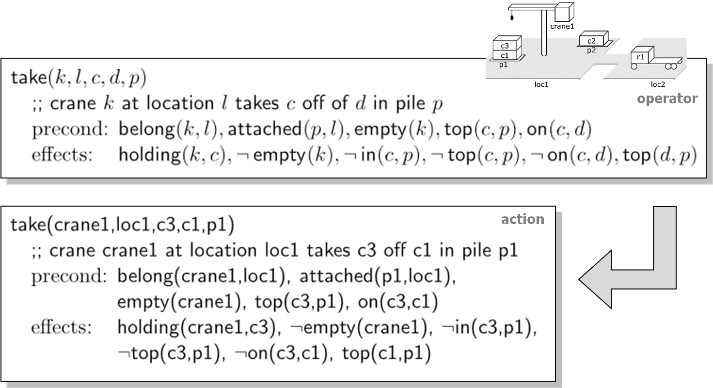
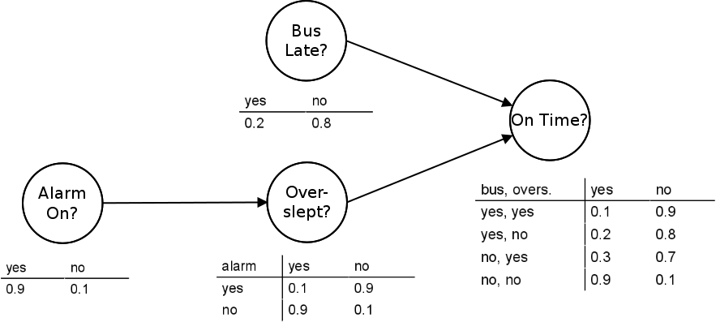
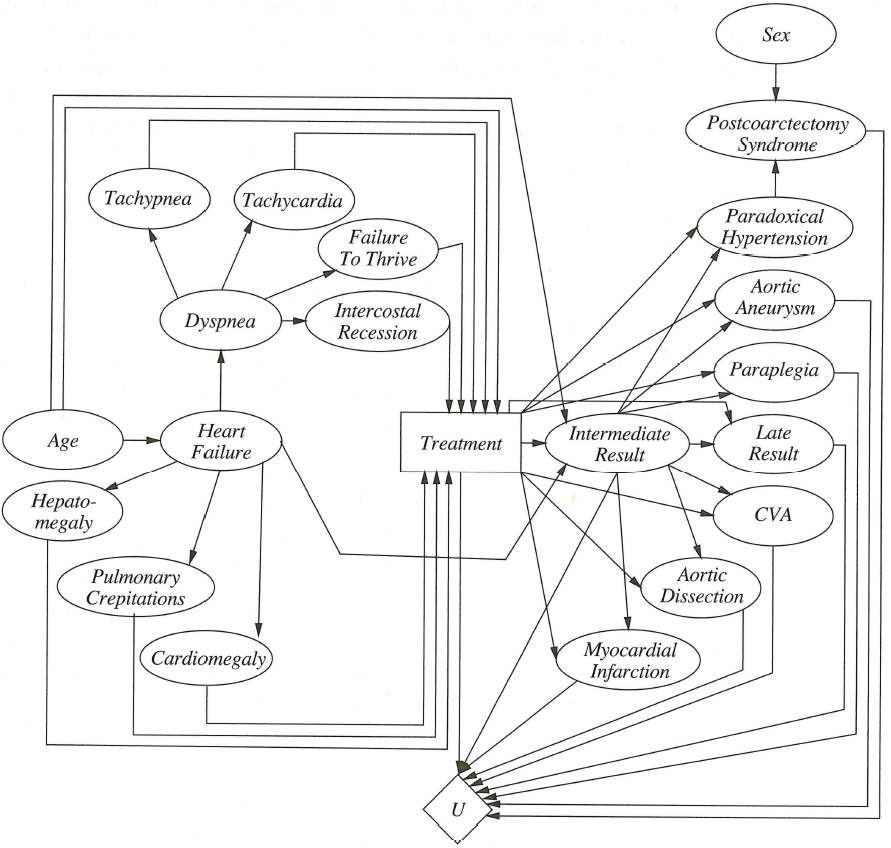

# 1. Metody umělé inteligence

*poznámky vytvořeny na základě přednášek a materiálů Hany Rudové z roku 2022*

> [Prohledávání stavového prostoru](#heuristické-algoritmy-pro-prohledávání-stavového-prostoru), [lokální prohledávání a metaheuristiky s jedním řešením](#single-solution-based-metaheuristics), [populační metaheuristiky](#population-based-metaheuristiky) ([evoluční algoritmy](#genetické-algoritmy), [inteligence hejna](#stádní-inteligence))]. [Plánování](#plánování), [reprezentace problému](#formalizace), [plánování se stavovým prostorem](#plánování-v-prostoru-stavů). Práce s neurčitostí, [Bayesovské sítě](#nejistota-bayesovské-sítě), [exaktní](#inference---enumerace) a [aproximační](#inference---aproximace) odvozování, [čas a neurčitost](#čas-a-nejistota), [teorie užitku](#utility-theory), [Markovský rozhodovací proces](#markov-decision-process-mdp), [iterace hodnot, iterace strategie](#value-iteration--policy-iteration). [Robotika](#robotika), [plánování pohybu robota (konfigurační prostor, kombinatorické a pravděpodobnostní přístupy)](#plánování-a-vykonávání-pohybu). (IV126)

## Úvod

- AI: konstrukce racionálních agentů
    - agent - senzory (vnímá prostředí), actuators (něco dělá)
    - racionální agent provádí takové akce, které maximalizují nějakou meriku hodnotící jeho výkon
    - jednoduchý reflexivní agent - vjem -> reakce, neuchovává žádnou historii
    - model-based reflxivní agent - vjem -> stav -> reakce, ve stavech se zachovává informace z historie
    - agent s cílem - vjem -> stav -> plánování -> reakce, snaží se dostat k cíli
    - agent s utility fcí - vjem -> stav -> plánování -> reakce, snaží se optimalizovat utility fci, nejisté znalosti a rozhodování obsahující nejistotu

## Heuristické algoritmy pro prohledávání stavového prostoru

- žádná garance kvality řešení
- metaheuristiky - vzory a metody, obecné postupy, které můžeme použít k řešení zadaných (optimlizačních) problémů
- design heuristiky: diversification vs. intensification 
    - eplorace, diversifikace, objevujeme nové, ale možná neprozkoumáme dost nadějné (př. random search)
    - exploitation, intensification, objevujeme nadějné, ale možná dost neprozkoumáme nové (př. local search)

### Hlavní koncepty 

#### Reprezentace řešení (encoding)

- binární - každá proměnná 0/1, řešení je vektor binárních hodnot
    - příklady:
        - problém batohu - pro každý předmět 1, pokud je v batohu, jinak 0
        - SAT - z definice binární, True/False
        - celočíselné programování s binárními hodnotami
- diskrétní - řešení jako vektor diskrétních hodnot z n-ární abecedy, vhodné pro kombinatorické problémy a problémy, kdy chceme něco někam přiřazovat
    - příklady:
        - alokace zdrojů
        - rozdělení úkolů
- permutace - plánování cesty, rozvrhování
    - příklady:
        - TSP
        - single machine scheduling
- reprezentaci chceme co nejmeší (ale stále úplnou) - líp se to pak prohledává
    - příklad s problémem královen na šachovnici
        - kartézský součin - $64^8$ možností
        - každá královna v jednom sloupci, určujeme jenom řádky - $8^8$ možností
        - každá královna v jednom řádku a navíc se sloupce neopakují - permutace, $8!$ možností

#### Objektivní funkce

- self-sufficient
    - objektivní funkce problému může být rovnou použita pro optimalizace
    - např. TSP: chceme co nejkratší cestu
    - nesplňuje např SAT: chceme splnit formuli
- guiding
    - nová funkce, protože jenom to, že víme, čeho chceme docílit, se nedá pro optimalizaci použít (SAT) nebo to není efektivní
    - příklad k-SAT := konjunkce m klauzulí nad k proměnnými
        - guiding function: maximalizace počtu splněných klauzulí
- měla by jít snadno upravit poté, co se provede změn, aby to bylo rychlé

#### Omezující podmínky

- řešení musí splňovat nějaké podmínky, co když je nesplňuje?
    - zamítáme - pracujeme pouze s přípustnými řešeními
    - penalizujeme - řešení uvažujeme, ale za nesplnění podmínek je penalizace o řád větší než účelová fce
    - opravíme - trasformace nepřípustného řešení na přípustné

#### Počáteční řešení

- vegenerované náhodně / nalezené hledaným algoritmem / vymyšlené člověkem
- chceme dobré počáteční řešení, ale zároveň rychle
- ne vždy vede lepší počáteční řešení k lepšímu výsledku
- pro problémy s hodně omezeními může být těžké vygenerovat přípustné počáteční řešení

#### Sousedství

- neighborhood je funkce $N: S \rightarrow 2^S$, která každému řešení $s \in S$ přiřadí množinu $N(s) \subset S$ 
- malá sousedství
    - příkaldy pro permutační problémy
        - k-distance: prohodí k pozic
        - k-opt: odebere k hran a nahradí je jinými
        - přesun pozice
        - inverze části
        - výměna dvojice
- velká sousedství - počet sousedů polynomiální s vysokým exponentem nebo exponenciální 
    - hlavní problém - jak vybrat zlepšujícího/nejlepšího souseda bez projití všech
    - výhody - můžeme řešení zlepšit o hodně, nezasekneme se v lokálním optimu
    - příklady
        - ejection chain - "opravné" operace
            - operace obvykle přesuny a swapy
            - první repair odebere nějaký defekt, ale způsobí nový
            - operace provádíme dokud nedojdeme k takové, která defekt nezpůsobí
            - příklad: routing problem s kapacitami aut, kde pokud nějaká trasa překračuje kapacitu, tak přesuneme bod do jiné trasy, ta tímto možná přesáhne kapacitu a tak dále
        - cyklická záměna
            - příklad: rozdělujeme n předmětů do m skupin tak, aby žádná nepřekročila kapacitu
- zěmna velikosti sousedství
    - postupně zvětšujeme, dokud nenajdeme zlepšujícího souseda

## Single-solution based metaheuristics

### Obecné lokální prohledávání

```python
input: počáteční řešení s_0
t = 0

while [není splněna podmínka]:
    # vygenerujeme kandidáty, úplné nebo částečné sousedství s_t
    C(s_t) = generate(s_t)

    # vybereme další řešení pro nahrazení současného
    s_t+1 = select(C(s_t))
    t += 1

output: s [lokální optimum]
```


### Local search / hill climbing

- jednoduché: v `select` je řešení nahrazeno prvním/libovolným/nejlepším lepším 

```python
# vygenerujeme počáteční řešení
s <- s_0      
while [není splněna podmínka]:
    # vygenerujeme sousedy s
    N(s) = generate(s)

    if [žádný soused není lepší]: 
        return s

    s = zlepšující soused s* z N(s)

output: s [lokální optimum]
```

### Simulované žíhání

- náhodně vygenerujeme souseda
- zlepšujícího souseda akceptujeme vždy, zhoršujícího podle cooling scheme
    - pravděpodobnost přijetí zhoršení je na začátku větší a pak se zmenšuje

### Threshold accepting

- deterministická varianta simulovaného žíhání
- akceptujeme řešení která nejsou horší než současné o moc, co znamená "ne o moc" se mění (menší tolerance)

```python
input: počáteční řešení s_0, počáteční threshold Q_0
Q = Q_0
s = s_0

while not [ukončovací podmínka, třeba Q < Q_min]:
    # s daným thresholdem opakujeme
    while [třeba konkrétní počet pokusů]:
        s* = generate_random_neighbor(s)
        delta = f(s*) - f(s) # změna, f ohodnocení řešení

        if delta <= Q
            s = s*
    
    # threshold update podle cooling scheme
    Q = g(Q)

output: s [lokální optimum]
```

### Record-to-record

- deterministická varianta simulovaného žíhání
- akceptujeme řešení která nejsou o moc horší než nejlepší dosud nalezené

```python
# minimalizujeme
input: počáteční řešení s_0, deviace D 
s = s_0
RECORD = f(s)

while not [ukončovací podmínka]:
    s* = generate_random_neighbor(s)
    if f(s*) < RECORD + D:
        s = s*
    if f(s*) < RECORD:
        RECORD = f(s*)

output: s [lokální optimum]
```

### Povodeň (great deluge)

- chceme být stále nad nějakým limitem

```python
# maximalizujeme
input: počáteční řešení s_0
s = s_0
UP      # rain speed
LEVEL   # počáteční hladina

while not [ukončovací podmínka]:
    s* <- generate_random_neighbor(s)
    if f(s*) > LEVEL
        s = s*
    LEVEL = LEVEL + UP

output: s [lokální optimum]
```

- nejdůležitější parametr UP
    - moc vysoký - rychlé, ale ne moc dobré výsledky
    - moc nízký - lepší řešení, ale trvá dlouho

### Tabu search

- deterministické rozšíření základního lokálního prohledávání 
    - často kombinované s jinými algoritmy
- můžeme akceptovat nezlepšující řešení
    - vždy vybíráme nejlepšího souseda, i když neexistuje zlepšující
        - abychom necyklili, zakážeme sousedy, které jsme předtím prošli -> tabu list
- tabu list
    - krátkodobá paměť
    - 5-9 předchozích pohybů (stavy na pamatování moc velké)
- aspiration criteria
    - podmínka, za které můžeme akceptovat i řešení z tabu listu
        - např. dovolíme, pokud vede v k nejlepšímu řešení

```python
input: počáteční řešení s_0
s = s_0
TL = [] # tabu list

while not [ukončovací podmínka]:
    # admissible = není na tabu listu a pokud jo, tak platí aspirační podmínka
    s* = find_best_admissible_neighbor(s)
    TL.append((s,s*)) # pohyb z s do s* přidáme na tabu list
    update_aspiration_criteria()
    s = s*

output: s [lokální optimum]
```

### Pokud máme čas, můžeme předchozí přístupy iterovat

- multistart local search
    - prostě začínáme znova, počáteční řešení nezávisle na předchozích bězích
- iterated local search
    - jeden local search, perturbace řešení, na perturbované znova local search
    - perturbace
        - velká náhodná změna 
        - část řešení zachována, část se změní
        - příliš velké změny jsou ekvivalentí k multistart, příliš malé nás nedostanou z lokálního optima
- můžeme měnit sousedství, která používáme, kde minimum v jednom není minimum ve druhém, tím utečeme z lokálního optima v tom prvním
    - systematická verze téhož: variable neighborhood descent
        - sousedství postupně zvětšujeme, když najdeme zlepšující řešení, tak zase smrskneme

```python
input: počáteční řešení s_0
s = s_0

while not [ukončovací podmínka]:
    l = 1
    while l < l_max:
        s* = find_best_neighbor(s,l) # l velikost sousedství
        if f(s*) < f(s):
            s = s*
            l = 1
        else:
            l =+1

output: s [lokální optimum]
```

## Population based metaheuristiky

```python
input: počáteční populace P_0
t = 0

while not [ukončovací podmínka]:
    P_t* = generate(P_t) # vygeneruj potomky
    P_t+1 = select(P_t,P_t*) # vyber z rodičů a potomků to nejlepší do nové generace
    t += 1

output: s [lokální optimum z P_t]
```

- hlavní skupiny
    - **evoluce** - řešení v populaci jsou vybírána a reprodukována, tím se populace blíží k optimu
        - př. genetické algoritmy
    - **blackboard** - řešení v populaci přispívají ke konstrukci sdílené paměti, nová populace vygenerována na základě této paměti
        - př. ant colony

### Počáteční řešení pro populační metaheuristiky

- náhodná populace
- sekvenční diverzifikace
    - řešení generována postupně, snažíme se, aby byla různá - nové musí být alespoň v nějaké vzdálenosti od starého
    - výpočetně náročné
- paralelní diverzifikace
    - řešení vegenerována paralelně a nezávisle, chceme je co nejrůznější
    - může být stejně složité nebo složitější než řešení původního problému
- heuristická inicializace
    - řešení generována nějakou heuristikou (př. local search s náhodným startem)
        - populace může snadno ztratit diverzitu

### Ukončovací podmínka

- statická
    - př. limitovaný CPU čas, max počet evaluací objektivní fce, ...
- adaptivní
    - př. počet iterací bez zlepšení, dosažení dost dobrého řešení, malá diverzita populace, ...

### Koncepty evolučních algoritmů

- populace - možina řešení (~20-100)
- chromozom/individum - jedno řešení
- gen - jedna proměnná v řešení
- alela - hodnota proměnné v řešení
- fitness - objektivní funkce, obvykle se maximalizuje
- strategie
    - **selekce** - jak vybrat rodiče 
        - ruleta (nejčastější)
            - pravděpodobnost výběru úměrná fitness
            - problém: často vybíráme nejlepší, zkonvergujeme moc brzy
            - řešení: stochastický univerzální výběr - jako kdybychom měli několik ukazatelů na ruletu
        - turnaj
            - náhodně vybereme $n$ individuí, z nich ponecháme nejlepší
            - pokud chceme vybrat více individuí, opakujeme
        - rank-based
            - spočítá se nějaký rank, který se pro výběr použije místo fitness funkce
    - **reprodukce** - jaké použít křížení a mutace 
        - mutace
            - malé změny jednoho individua, pravděpodobnost mutace každého genu je malá (cca [0.001,0.01])
                - pravděpodobnost může být například taková, aby průměrně mutoval jeden gen
            - binární: flip genu
            - diskrétní: změna jednoho genu na jinou hodnotu z abecedy
            - v permutaci: insert, swap, inverze
        - crossover (křížení)
            - binární operátor (občas $n$-ární)
            - cíl: podědit něco od obou (více) rodičů a tím vygenerovat potomky
            - pravděpodobnot (crossover rate, kolik rodičů se účastní) [0,1], obvykle [0.45,0.95]
            - pro lineární reprezentace (bez permutací)
                - 1-point crossover: vyberu jedno místo, do něj první rodič, pak druhý
                - 2-point ($n$-point) crossover: vyberu více míst a střídám rodiče
                - uniform crossover: každá gen náhodně vybraný z jednoho z rodičů, každý rodič přispívá stejně
            - pro permutace: order crossover
                - dva body vybrány náhodně, mezi nimi z jednoho rodiče, zbytek ze druhého v pořadí, v jakém to tam je, začíná se za druhým bodem
    - **replacement** - kdo z rodičů a dětí pokračuje do další generace
        - generační: vždy nahradíme rodiče potomky
        - steady-state: jeden potomek vygenerován, nahradí nejhoršího člena populace
        - nahrazení pevného počtu individuí
        - elitářství: vybereme nejlepší z rodičů i potomků

```python
input: počáteční populace P_0
t = 0

while not [ukončovací podmínka]:
    evaluate(P_t)
    P_t_select = selection(P_t)      # vybereme rodiče 
    P_t* = reproduction(P_t_select)  # vygenerujeme potomky
    evaluate(P_t*)
    P_t+1 = replace(P_t,P_t*)
    t += 1

output: s [lokální optimum]
```

### Genetické algoritmy

- binární reprezentce (původně, dnes i jiné typy)
- obvykle aplikuje křížení (crossover) na dvě řešení, mutace se používají na podporu diverzity
- pevné pravděpodobnosti pro crossover a mutaci
- generační nahrazení - rodiče za potomky, nikoliv výběr

### Evoluční strategie

- spojitá optimalizace, vektory reálných hodnot
- křížení zřídka (vhodné pokud není smysluplný operátor pro křížení)
- vygeneruje se více potomků, než bylo rodičů (l > m)
- obvykle elitní nahrazení - nejlepří z rodičů i potomků
    - (1+1)-ES: rodič nahrazen potomkem, pokud je potomek lepší
    - (m+l)-ES: l-krát náhodně vybereme rodiče a vygenerujeme potomka, potom rodiče i potomky střídíme podle fitness a vybereme m nejlepších
    - (m,l)-ES: vybereme novou populaci jenom mezi potomky

### Stádní inteligence

- inspirováno chováním rybích hejn, mravenců, včel...
- jednoduché částice, spolupracují pomocí nepřímého komunikačního média, pohybují se ve stavovém prostoru

#### Ant colony optimization ~ AOC

- myšlenka - hledáme cestu mezi dvěma body, mravenci zanechávají na cestě feromony, tím vedou ostatní

```python
P = inicializace matice feromonů
A = inicializace mravenců

while not [ukončovací podmínka]:
    for ant in A:
        konstrukce cesty pro ant pomocí matice P
    evaporace P
    reinforcement P 

output: [nejlepší nalezené řešení]
```

- evaporace: $P_{ij} = (1-r)P_{ij}$, kde $r$ z intervalu [0,1]
- reinforcement
    - online v každém kroku každého mravence
    - online na konci generování cesty jednoho mravence
        - update proporční ke kvalitě nalezené cesty
    - offline až poté, co všichni mravenci vygenerují své cesty - viz pseudokód
        - záleží na kvalitě, například můžeme update založit jenom na k nejlepších nalezených cestách

#### AOC pro TSP

```python
P = inicializace matice feromonů
A = inicializace mravenců

while not [ukončovací podmínka]:
    best_path = []

    for ant in A:
        S = {1,2, ..., n} 
        i = pop_random(S) # náhodně vybereme z S počáteční město i a přidáme ho do cesty
        path = [i]
        while S != {}:
            j = pop_random(S, p_ij) # vybereme s pravděpodobností p_ij další město j a přidáme ho do cesty
            path.append(j)
            i = j
        if path better than best_path:
            best_path = path

    # evaporate P
    for i,j in [1,n]
        P_ij = (1-r)P_ij

    # reinforcement P 
    for (i,j) in best_path:
        P_ij = P_ij + delta

output: [nejlepší nalezené řešení]
```

- pravděpodobnosti $p_{ij}$
    - $p_{ij} = P_{ij} / \sum_{k \in S}(P_{ik})$
- heuristika závislá na konkrétním problému
    - $n_{ij} = 1/d_{ij}$, kde $d_{ij}$ je vzdálenost $i$ a $j$
    - $p_{ij} = P_{ij}^\alpha \cdot n_{ij}^\beta / \sum_{k \in S}(P_{ik}^\alpha \cdot n_{ik}^\beta)$
    - $\alpha = 0$: greedy search
    - $\beta = 0$: jenom feromony

## Plánování

- plánovací problém
    - máme počáteční stav světa, popis akcí, které můžeme provádět a požadovaný stav
    - výsup je sekvence akcí
    - rozhodujeme, které akce máme provést, abychom se dostali k cíli
    - obvykle horší než NP-úplná složitost
    - klasické plánování je rozhodnutelné
        - nemáme funkční symboly, takže máme konečný počet stavů
- planner generuje plán, controller ho usputečňuje
    - dynamické plánování: pokud se akce nepovede, přeplánujeme
- rozvrhování
    - rozhodujeme, jak uskutečnit akce za danách podmínek (omezené zdroje a čas)
    - obvykle NP-úplné

### Formalizace

- **plánovací doména** je čteřice $\Sigma = (S,A,E,\gamma)$ kde
    - $S$ je rekurzivně spočetná množina stavů
    - $A$ je rekurzivně spočetná množina možných akcí, obsahuje prázdnou akci
    - $E$ je rekurzivně spočetná množina možných událostí, obsahuje prádnou událost
    - $\gamma$ je tranzitivní funkce, $\gamma: S \times A \times E \rightarrow P(S)$
        - $P(S)$ značí potenční množinu S
        - akce a události občas aplikovány zvlášť, tedy $(A \cup E)$ místo $(A \times E)$
- **cíl**
    - cílový stav nebo množina cílových stavů
    - splnění nějakých podmínek danou sekvencí navštívených stavů
        - př. musíme projít konkrétní stavy
    - optimalizace nějaké objektivní funkce na provedených akcích
        - př. co nejmenší cena sekvence akcí

#### Naše předpoklady

- systém je konečný
- plně pozorovatelný, známe současný stav
- deterministický
    - $\gamma: ... \rightarrow S$ místo $\gamma: ... \rightarrow P(S)$
- statický, tedy $E = \emptyset$
- cílem je dosáhnout některého z množiny cílových stavů
- plány jsou prováděny sekvenčně, sestávají z uspořádané sekvence akcí
- čas je implicitní, akce instantní (nic netrvají)
- plánování je provedeno offline, stav světa se nemění v průběhu plánování 
- **klasické plánování**
    - plánovací problém je trojice $P=(\Sigma,s_0,g)$, kde $s_0$ je počáteční stav a $g$ popis cílového stavu
    - řešením plánovacího problému $P$ je sekvence akcí $<a_1,a_2,...,a_k>$ a příslušných stavů $<s_0,s_1,...,a_k>$ takových že $s_i = \gamma(s_{i-1},a_i)$ a $s_k$ splňuje $g$
    - plánování odpovídá hledání cesty v grafu definovaném stavy (vrcholy) a tranzitivní funkcí (hrany)
        - zní jednoduše, ale ten graf by byl vážně velký
            - chceme reprezentovat stavy a akce bez jejich vyjmenování $\rightarrow$ [množinová reprezentace](#možinová-reprezentace), [klasická reprezentace](#klasická-reprezentace)
        - jak řešit efektivně?

#### Možinová reprezentace

- stav je zapsán jako množina předpokladů, které v něm platí
- pro každou akci máme popis, co musí platit, aby byla aplikovatelná, a jaké předpoklady jsou její aplikací přidány/odebrány
- velikost množinové reprezentace může být problém!

#### Klasická reprezentace

- zobecňuje množinovou reprezentaci pomocí logiky prvního řádu
    -  atom je predikátový symbol s dosazenými argumenty
    - používáme predikátové symboly a kostanty, žádné fukční symboly
- **stav je množina instanciovaných atomů**, které jsou v daném stavu pravdivé
    - žádné proměnné
    - konečný počet stavů
    - fluents - atomy, jejichž pravdivost se mění
    - rigid atoms - atomy, jejichž pravdivost se nemění, jsou ve všech stavech stejné
- plánovací operátory
    - trojice (název, předpoklady, efekty)
        - název ve tvaru n(x1,...,xk), n symbol operátoru, předpoklady musí být splněny, aby mohl být operátor aplikován, efekty se stanou pravdivými po aplikaci operátoru (nesmí tam být rigid atoms)
    - **akce je plně instanciovaný operátor**, mění pravdivostní honotu některých atomů
- předpoklad uzavřeného světa - pokud atom není ve stavu obsažen, tak v něm neplatí
- použití akce
    - notace: $S^+$ = {pozitivní atomy v $S$}, $S^-$ = {negativní atomy v $S$}
    - akce $a$ je aplikovatelná na stav $s$ $\iff precond^+(a) \subseteq s \land precond^-(a) \cap s = \emptyset$
    - výsledek aplikace akce $\gamma(s,a) = (s-effects^-(a)) \cup effects^+(a)$
- plánovací doména na jazykem $L$ s operátory $O$ je trojice $\Sigma = (S,A,\gamma)$ kde
    - stavy $S \subseteq$ $P$({všechny instanciované atomy nad $L$})
    - akce $A$ = {všechny instanciované operátory z $O$ nad $L$}
    - tranzitivní fce $\gamma(s,a) = (s-effects^-(a)) \cup effects^+(a)$, pokud $a$ je aplikovatelná na $s$
        - množina stavů je uzavřená vzhledem k tranzitivní funkci
- plánovací problém je trojice $P=(\Sigma,s_0,g)$, kde $\Sigma$ je plánovací doména, $s_0 \in S$, $g$ je množina instanciovaných literálů
    - stav $s$ splňuje $g \iff g^+ \subseteq s \land g^- \cap s = \emptyset$
    - obvykle je problém zadán jako trojice  $(O,s_0,g)$, kde $O$ definuje použité operátory a predikáty, $s_0$  definuje konstanty



### Plánování v prostoru stavů

- prohledávaný prostor odpovídá stavovému prostoru plánovacího problému
    - vrcholy ~ stavy
    - hrany ~ akce
    - hledáme cestu z počátečního do cílového stavu
- všechny zmíněné algoritmy uvažujeme pro klasickou reprezentaci

#### Dopředné plánování

- začínáme v počátečním stavu a jdeme k nějakému cílovému
- co potřebujeme umět poznat
    - stav je cílový stav
    - množina aplikovatelných akcí pro daný stav
    - v jakém stavu budeme po aplikování akce

```python
input: (O,s_0,g)
s = s_0
p = [] # prázdný plán

while not [s splňuje g]:
    # množina akcí, jejichž předpoklady jsou splněny v s
    E = {a | a je plně instanciovaný operátor z O, precond(a) platí v s} 

    if E is empty:
        return Fail
    
    a = vybereme nějakou akci z E # může být nedeterministicky
    # updatujeme stav
    s = gamma(s,a)
    # prodloužíme plán o další akci
    p = p.append(a)

output: plán p
```

- algoritmus je korektní (když dá řešení, tak správné)
- algoritmus je úplný (pokud existuje plán vedoucí k cíli, tak alespoň jedna z větví prohledávání tento plán najde) 
    - důkaz indukcí dle délky plánu
        - v každém kroku má algoritmus možnost vybrat správnou akci, protože pokud je plán řešení, tak je tato akce aplikovatelná
- implementace
    - deterministicky
        - BFS - korektní, úplný, žere paměť
        - DFS - korektní, úplný (pokud kontrolujeme, že na větvích prohledávání neopakujeme stavy)
        - A* - korektní, úplný pokud má graf konečný branching factor (má) a váhy hran jsou větší než 0
            - nejčastěji používaný algoritmus
            - v každém vrcholu n odhadneme f(n) = g(n) + h(n) kde g(n) je cena dosavadní cesty do vrcholu a h(n) heuristika (musí být přípustná, tedy nikdy nepřeceníme cenu do konce)
            - zásadní je dobrá heuristika
- problém: velký branching factor
    - obecně problém pro deterministické algoritmy, zkouší všechny možnosti
    - řešení: heuristiky (A*), prořezávání stavového prostoru 
        - př. pokud dojdeme dvěma plány do stejného stavu, zachováme jen ten kratší
            - musíme si pamatovat stavy

```python
# A* 
input: startNode, goal

# initialize both open and closed list
openList = []
closedList = []

# add the start node
openList.append(startNode)

while openList is not empty:
    currentNode = pop_min_f(open_list)
    closedList.append(currentNode)
    if currentNode is goal:
        get path using backtrakcing
    
    for child in children(currentNode):
        if child is in closedList:
            continue 
        child.g = currentNode.g + distance_real(child,currentNode)
        child.h = distance_estimate(child,goal)
        child.f = child.g + child.h        
        if child is in openList:
            if child.g > openList_child.g
                continue 
        openList.add(child)
```

#### Zpětné plánování

- začínáme s cílem (ne cílovým stavem, těch může být víc) a skrz postupné podcíle se dostáváme na start
- co potřebujeme umět poznat
    - stav splňuje aktuální cíl
    - relevantní akce pro každý cíl $g$ 
        - akce $a$ je relevantí pro $g$ iff
            - přispívá k cíli: $g \cap effects(a) \neq \emptyset$
            - nekonfliktní: $g^+ \cap effects^-(a) = \emptyset \land g^- \cap effects^+(a) = \emptyset$
    - jak definovat předchozí cíl tak, že ho vybraná akce převede na současný cíl
        - regresní množina - nový cíl, získáme reverzí vybrané akce na aktuální cíl
            - $\gamma^{-1}(g,a) = (g-effects(a)) \cup precond(a)$

```python
input: (O,s_0,g)
p = [] # prázdný plán

until [s_0 splňuje g]
    # množina akcí, pomocí kterých jsme mohli splnit něco z cíle
    A = {a | a plně instanciovaný operátor z O a gamma^-1(g,a) je definována} 

    if A is empty:
        return Fail
    
    a = vybereme nějakou akci z A # může být nedeterministicky

    # prodloužíme plán o další akci
    p = [a] + p 

    # změníme cíl
    g = gamma^-1(g,a)

output: plán p
```

- algoritmus je korektní a úplný
- můžeme implementovat deterministickou verzi, pro úplnost musíme kontrolovat cyklení
- branching factor
    - může být menší než pro dopředné plánování - pro cíl méně relevantních akcí
    - stále může být příliš velký
        - operátory můžeme instanciovat pouze částečně (př. chceme auto na pozici 1 a je nám jedno, ze které z 50 možných pozic přijede) - lifting
            - použijeme MGU (most general unification) a standardizaci, ale budeme tím mít složitější kontrolu cyklení

``` python
input: (O,s_0,g)
p = [] # prázdný plán

until [s_0 splňuje g]
    # MGU = nejobecnější unifikace
    # standardizace = kopie s novými proměnnými
    A = {(o,t) | o je standardizace operátoru z O, t je MGU pro atom g a atom effects(o) a gamma^-1(t(g),t(o)) je definována} 

    if A is empty:
        return Fail
    
    a = vybereme nějakou akci z A # může být nedeterministicky

    # prodloužíme plán o další akci
    p = [a] + p 

    # změníme cíl
    g = gamma^-1(g,a)
output: plán p
```

## Nejistota: Bayesovské sítě

### Podmíněná pravděpodobnost

- evidence - všechny informace, které máme
- podmíněná pravděpodobnost $P(X|Y) = P(X,Y)/P(Y)$ pro $P(Y) > 0$
- pro $X,Y$ nezávislé proměnné: $P(X|Y) = P(X), P(X,Y) = P(X)P(Y)$
- úplná sdružená distribuce (joint probability distribution) - popis tabulkou, co se kdy děje
    - pokud chceme znát pravděpodobnost nějakého tvrzení, sečteme případy, ve kterých platí (summing out, marginalization)
        - $P(Y) = \sum_{z \in Z}P(Y,z)$
- zajímá nás odhalení zdrojů dle symptomů - diagnostická vazba $P(nemoc|symptomy)$
    - kauzální vazbu známe - tj. víme, jaká je $P(symptomy|nemoc)$
- Bayesova věta
    - $P(Y|X) = P(Y,X)/P(X) = P(X|Y)P(Y)/P(X) \approx \alpha * P(X|Y)P(Y)$
    - $\alpha$ je normalizační konstanta, abychom mohli dočasně zanedbat $P(X)$

### Bayesovská síť

- specifikuje podmíněné pravděpodobnosti mezi náhodnými proměnnými
- DAG ~ vrcholy náhodné proměnné (předchůdci rodiče), hrany vlivy
    - každý vrchol má podmíněnou pravděpodobnostní distribuci $P(X|parents(X))$
        - popsané pomocí conditional probability tables (CPS)
- síť reprezentuje full joint probability distribution $P(x_1,...,x_n) = \prod_i P(x_i|parents(X_i))$
- full joint probability distribution umí dát odpověď na libovolnou otázku v dané doméně, BN tedy taky
    - použijeme marginalizaci
- kompaktnější než full joint probability distribution
    - náhodné proměnné jsou ovlivněny jen některými dalšími
    - můžeme ignorovat slabé vlivy (zabere méně místa, je méně přesné)
    - je potřeba správně uspořádat vrcholy



#### Konstrukce

- $P(x_1,...,x_n) = \prod_i P(x_i|x_{i-1},...,x_1)$ 
    - *product rule $P(A,B)=P(B|A)P(A)=P(A|B)P(B)$*
    - $P(X_i|X_{i-1},...,X_n) = \prod_i P(X_i|parents(X_i))$ za podmínky $parents(X_i)\subseteq \{X_{i-1},...,X_1\}$
        - podmínka je splněna očíslováním vrcholů podle částečného uspořádání DAGu
- máme tedy joint probability distribution $P(x_1,...,x_n) = \prod_i P(x_i|parents(X_i))$
- algoritmus
    - definujeme náhodné proměnné $X_i$ ~ vrcholy
        - nejlepší, pokud seřadíme tak, že příčiny předcházejí následky
    - hrany - rodiče vrcholu jsou ty vrcholy, které ho přímo ovlivňují
        - postupně pro každé $i$: vybereme $X_i$
        - z množiny $\{X_1,...,X{i-1}\}$ vybereme minimální množinu rodičů
            - tak, že $P(X_i|parents(X_i)) = P(X_i|X_{i-1},...,X_1)$
    - garantuje acykličnost, je konzistentní

#### Inference - enumerace

- inference je to, proč jsme síť vlastně stavěli
- chceme zjistit $P(X|e)$, kde $e$ je pozorování (evidence), a neznáme hodnoty zbylých proměnných Y
    - $P(X|e) = \alpha P(X,e) = \alpha \sum_y P(X,e,y)$
    - výpočet můžeme reprezentovat stromem, pokud má vrchol dva syny, tak sčítáme, jinak násobíme

```python
def enum(X,e,BN): # vrací distribuci X
    input: X    # proměnná, jejíž distribuci v závislosti na pozorování e chceme zjistit 
           e    # evidence
           BN   # Bayesovská síť s proměnnými {X}, E a Y (Y skryté)
    Q(X) = prázdná distribuce nad honotami X
    for [každá možná hodnota x_i proměnné X]:
        # přidáme x_i do evidence a vyhodnotíme
        Q(x_i) = enum_values(BN.vars,{e,x_i})
    return normalize(Q(X))

def enum_values(vars,e): # vrací reálné číslo
    if vars is empty:
        return 1.0
    
    Y = vars.pop()
    if [y je hodnota Y v e]:
        return P(y|Parents(Y)) * enum_values(vars,e)
    else:
        return sum_y P(y|Parents(Y)) * enum_values(vars,{e,y})
```

- eliminace proměnných
    - části výpočtu se opakují, můžeme si je pamatovat
    - výpočet budeme provádět z prava do leva (pro strom výpočtu to odpovídá postupu zdola nahoru)
    - zavedeme faktory f (tabulky/matice)
        - součin prvků matic odpovídá násobení faktorů
        - summing out - součet faktorů se zafixovanou hodnotou pro obě možnosti
        - na konci normalizace
    - algoritmus funguje pro libovolné uspořádání proměnných
        - složitost závisí na velikosti vzniklých faktorů
        - chceme brát proměnné v takovém pořadí, aby vzniklé faktory byly co nejmenší (heuristicky)
- složitost
    - pokud je síť strom, je čas i prostor lineární vzhledem k velikosti sítě
    - pokud síť není strom, může být 3-SAT převeden na BN, takže je inference NP-těžká

#### Inference - aproximace

- založená na Monte Carlo metodách
    - generujeme mnoho samplů, odhadneme přesné hodnoty
- přímé samplování
    - sample odpovídá dosazení za náhodné proměnné
    - samply by měly být generovány ze známé distribuce
        - vrcholy jsou uvažovány v topologickém pořadí
        - distribuce je podmíněna již zvolenými hodnotami rodičů

```python
def sample(BN): # vrací sample
    x = sample s n prvky (tolika, kolik je v BN náhodných proměnných), všude 0
    for i = 1..n
        x_i = random sample P(X_i|parents(X_i)), hodnoty parents(X_i) již jsou dány v x
    return x
```

- samplování zamítáním
    - hledáme $P(X|e)$, máme $e$
    - z vygenerovaných vzorků zamítneme ty, které nejsou konzistentní s $e$
    - problém: zamítneme příliš mnoho vzorků

```python
def rejection_sample(X,e,BN,N ~ počet prvků k vygenerování): # vrací sample
    for value x in X
        M[x] = 0
    for j in 1..N:
        s = sample(BN)
        if s konzistentní s e:
            M[x] = M[x] + 1 kde x je honota X v s
    return normalize(M)
```

- vážení pravděpodobnosí
    - lépe než zamítat nekonzistentní je rovnou generovat konzistentní
    - pravděpodobnost získání samplu se zafixovaným $e$: $P_{LW}(z,e)=\prod_{i}P(z_i|parents(Z_i))$
        - ale chybí tam pravděpodobnost pro $e$: $w(z,e)=\prod_{j}P(e_j|parents(E_j))$
    - celkově $P(z,e)=\prod_{i}P(z_i|parents(Z_i))\prod_{j}P(e_j|parents(E_j))=P_{LW}(z,e)w(z,e)$
    - každý vygenerovaný sample tedy uděláme vážený: $P(X|e) \approx \alpha N(X,e)w(X,e)$

```python
def weighted_sample(BN,e): # vrací sample
    w = 1
    x = sample s n prvky (tolika, kolik je v BN náhodných proměnných), fixované hodnoty e
    for i in 1..n:
        if hodnota x_i pro X_i je v e:
            w = w * P(X_i = x_i|parents(X_i))
        else:
            x_i = random sample P(X_i|parents(X_i)) # hodnoty parents(X_i) již jsou dány v x
    return x, w

def likelihood_weighting(X,e,BN,N ~ počet prvků k vygenerování): # vrací sample
    for value x in X
        W[x] = 0
    for j in 1..N:
        x,w = weighted_sample(BN)
        W[x] = W[x] + w # kde x je honota X v s
    return normalize(W)
```

## Čas a nejistota

- aget je v částečně pozorovatelném prostředí
    - udržuje si "belief state" 
        - které stavy jsou aktuálně na základě dostupných informací možné
        - může obsahovat i údaj o pradvěpodobnosti jednotlivých stavů
- svět pozorujeme v sérii time slices (časových bodů) - stavy
    - $t$ identifikuje aktuální čas
    - uvažujeme diskrétní čas s uniformními kroky
    - každý time slice (stav) je popsán náhodnými proměnnými
        - $X_t$ skryté náhodné proměnné (hidden, jejich hodnotu neznáme), $E_t$ pozorovatelné
        - značení $X_{t_1:t_2}$ značí množinu skrytých náhodných proměnných od $t_1$ do $t_2$

### Markov assumptions (Markovovské předpoklady)

- **transition model**
    - používáme k predikci budoucích stavů
    - specifikuje pravděpodobnostní distribuci v posledním stavu, $P(X_t|X_{0:t-1})$
    - problém: množina $X_{0:t-1}$ je neomezená, pro rostoucí $t$ stále roste
        - Markovovský předpoklad: současný stav závisí na pevném konečném počtu předchozích stavů
            - pokud proces toto splňuje, pak jej můžeme označit za Markovovský proces, Markov chain
            - Markovovský proces prvního řádu: $P(X_t|X_{0:t-1}) = P(X_t|X_{t-1})$
    - problém: nekonečně mnoho možných hodnot $t$
        - uvažujeme stacionární procesy, tedy $P(X_t|X_{t-1})$ je stejné pro všechna $t$
- **sensor model**
    - získáváme informace o světě
    - popisuje, jak evidence závisí na ostatních proměnných
        - může záviset na předchozích i současných hodnotách proměnných
    - Markovův předpoklad pro senzory: současný stav evidence závisí jen na současném stavu skrytých proměnných
        - $P(E_t|X_{0:t},E_{1:t-1})=P(E_t|X_t)$
- zpřesnění modelů
    - Markovovy předpoklady model hodně zjednodušily, ale co když neplatí úplně?
        - vyšší řád Markov process modelu
        - více proměnných
            - vyšší řád Markov process modelu se dá vždy přeformulovat jako přidání proměnných
- transition a sensor model můžeme popsat pomocí BN
    - musíme přidat $X_0$, tedy jak to všechno začalo
        - potom full joint distribution probability: $P(X_{0:t}|E_{1:t})=P(X_0)\prod_{i=1}^tP(X_i|X_{i-1})P(E_i|X_i)$

#### Inference 

- **filtrování**: aktuální stav? $P(X_t|e_{1:t})$
    - užitečný algoritmus musí udržovat a updatovat aktuální stav, ne se vždy rekurzivně vracet
        - $P(X_{t+1}|e_{1:t+1}) = f(e_{t+1},P(X_t|e_{1:t}))$
        - jak definovat funkci $f$?
            - $P(X_{t+1}|e_{1:t+1})$
            - $= P(X_{t+1}|e_{1:t},e_{t+1})$
            - $= \alpha P(e_{t+1}|X_{t+1},e_{1:t})P(X_{t+1}|e_{1:t})$ z Bayesova pravidla
            - $= \alpha P(e_{t+1}|X_{t+1})P(X_{t+1}|e_{1:t})$ Markov sensor assumption
            - $= \alpha P(e_{t+1}|X_{t+1}) \sum_{x_t}P(X_{t+1}|x_t,e_{1:t})P(x_t|e_{1:t})$ marginalizace
            - $= \alpha P(e_{t+1}|X_{t+1}) \sum_{x_t}P(X_{t+1}|x_t)P(x_t|e_{1:t})$ Markovův proces prvního řádu
                - poslední člen rekurzivní 
        - $f_{1:t}$ propagujeme dopředu
            - $P(X_{t}|e_{1:t}) = f_{1:t}$
            - $f_{1:t+1}=\alpha forward(f_{1:t},e_{t+1})$
            - na začátku $P(X_0)$
- **predikce**: budoucí stav? $P(X_{t+k}|e_{1:t})$ kde $k>0$
    - $P(X_{t+k+1}|e_{1:t})= \sum_{x_{t+k}}P(X_{t+k+1}|x_{t+k})P(x_{t+k}|e_{1:t})$
    - jako filtrování bez přidávání evidence
        - po nějaké době zkonverguje
- **smoothing**: pravděpodobnost minulého stavu když už víme, jak to bylo doopravdy? $(X_{k}|e_{1:t})$ kde $0 \leq k < t$
    - $P(X_{k}|e_{1:t}) = P(X_{k}|e_{1:k},e_{k+1:t})$
    - $=\alpha P(X_{k}|e_{1:k})P(e_{k+1:t}|X_{k},e_{1:k})$ z Bayesova pravidla
    - $=\alpha P(X_{k}|e_{1:k})P(e_{k+1:t}|X_{k})$
    - $=\alpha F_{1:k} \times b_{k+1:t}$ rekurze pro $f$ zpět a pro $b$ dopředu
    - nová funkce $b_{k+1:t}=P(e_{k+1:t}|X_{k})=$
    - $=\sum_{x_{k+1}}P(e_{k+1:t},x_{k+1}|X_k)$
    - $=\sum_{x_{k+1}}P(e_{k+1:t}|X_k,x_{k+1})P(x_{k+1}|X_k)$
    - $=\sum_{x_{k+1}}P(e_{k+1:t}|x_{k+1})P(x_{k+1}|X_k)$
    - $=\sum_{x_{k+1}}P(e_{k+1},e_{k+2:t}|x_{k+1})P(x_{k+1}|X_k)$
    - $=\sum_{x_{k+1}}P(e_{k+1}|x_{k+1})P(e_{k+2:t}|x_{k+1})P(x_{k+1}|X_k)$
- **nejpravděpodobnější vysvětlení**: $argmax\{X_{1:t}\}P(X_{1:t}|e_{1:t})$

### Utility theory

- chceme navrhnout racionálního agenta
    - maximalizuje účelovou funkci $U(s)$
        - nepřímo, vlastně vybíráme akce tak, abychom maximalizovali expected utility (MEU)
            - $\mathbb{E}U(a|e) = \sum_s P(result(a)=s|a,e)U(s)$ kde $e$ evidence, $a$ akce
            - $a = argmax_{a}\mathbb{E}U(a|e)$ výběr akce
    - využívá pravděpodobnost aby věděl, v jakém stavu je (viz výše)
- **utility theory (co agent chce) + probability theory (čemu agent na základě důkazů věří) = decision theory (co by měl agent udělat)**
- racionální preference
    - chceme funkci, která nám určuje preference
        - př. preferujeme $A > B$, $A < B$, nevíme $A \approx B$ 
        - $A, B$ mohou být stavy, ale často jde o nějakou nejistotu, loterii
    - utility fce převádí stavy/loterii na reálná čísla
        - tedy $U(A) = U(B) \iff A \approx B$,  $U(A) > U(B) \iff A > B$
        - expected utility loterie? $U([p_1,S_1;...;p_n,S_n])=\sum_i p_i U(S_i)$
    - pozorováním preferencí můžeme sestrojit utility funkci
- **jak tedy sestrojit utility funkci?**
    - normalized utility function
        - nejlepší utility je $U(S_{max})=1$
        - nejhorší utility je $U(S_{min})=0$
    - v každém stavu $S$ necháme agenta vybrat mezi utility a standardní loterií $[p,S_{max};1-p,S_{min}]$
        - pravděpodobnost upravujeme dokud není agent nerozlišitelný od loterie s tímto $p$
        - $U(S)=p$
- utilita peněz
    - peníze se nechovají jako utility fce, i když to tak může vypadat
    - pro každého mají jinou hodnotu
- v reálném světě má utility fce obvykle více atributů - př. cena, bezpečnost
    - př. můžeme buď vybrat nejdůležitější atribut, nebo je kombinovat
        - strict dominance - pokud pro nějaký stav jsou všechny atributy vyšší než pro jiný, je lepší
            - pro nejistotu - pokud všechny možné výsledky A jsou lepší než všechny možné výsledky B
        - stochastic dominance
        - kompletní utility fce pro n atributů s d hodnotymi má $d^n$ možností, ale reálně obvykle méně, protože mezi preferencemi je struktura
            - můžeme popsat jako $U(x_1,...,x_n)=F[f_1(x_1),...,f_n(x_n)]$
            - pokud jsou atributy nezáviské $U(x_1,...,x_n)=\sum_i U_i(x_i)$

### Rozhodování

> - probability theory describes what an agent should believe on the basis of evidence
> - utility theory describes what an agent wants
> - decision theory combines them to describe what an agent should do

#### Decision network

- diagram vlivů, reprezentuje informaci o současném stavu, možných akcích a stavech, kam se jimi dá dostat, a utilitu těchto stavů
    - vrcholy šancí (chance nodes) - náhodné proměnné jako v Bayes network
    - rozhodovací vrcholy (decision nodes) - v nich se vybírá akce
    - vrcholy utility - popisují utility fci
- evaluace - akci vybereme evaluací pro všechna možná nastavení rozhodovacích vrcholů

```
nastavíme evidence pro aktuální stav
pro každou možnou hodnotu rozhodovacího vrcholu
    nastav na tuto hodnotu
    spočítej pravděpodobnosti pro rodiče utility vrcholů
    spočítej utilitu
vrať akci s největší utilitou
```

- konstrukce
    - tvorba modelu
    - zjednodušení na rozhodovací model - vypustíme, co nepřispívá k rozhodnutí
    - přiřazení pravděpodobností
    - přiřazení utilit
    - potvrzení modelu (př. kontrola odborníky)
    - analýza senzitivity - jak se model změní při drobné změně pravděpodobností



#### Sekvenční rozhodovací problémy

- do teď jsme uvažovali jedno rozhodnutí, teď budeme uvažovat sekvenci
- transition model - popisuje zisk každé akce v každém stavu pomocí $P(s'|s,a)$
    - model je Markovovský - pravděpodobnost dosažení stavu $s'$ ze stavu $s$ nezávisí na historii
- utility fce
    - vztažená k sekvenci naplánovaných rozhodnutí
    - každý stav má omezený reward R(s), utility fce sčítá rewards navštívených stavů

#### Markov decision process (MDP)

- sekvenční rozhodovací problém v plně pozorovatelném, stochastickém prostředí, s Markovovským transition modelem a aditivními zisky
    - MDP definován pomocí
        - množiny stavů
        - počátečního stavu
        - akcí v každém stavu
        - transition modelem
        - zisky/rewards R(s)
- řešením nemůže být sekvence akcí, protože to se nedá použít ve stochastickém prostředí
    - místo toho pro všechny stavy specifikujeme, co v nich má agent dělat
        - **policy - a function recommending an action for each state**
            - optimal policy vede k nejvyšší expected utility
- **utility fce v čase**
    - konečný horizont 
        - zafixujeme, kolik kroků dopředu nás zajímá
        - postupně se tedy může měnit optimální akce v nějakém stavu, podle toho, jak vidíme dál
    - horizont v nekonečnu
        - optimal policy je stacionární, od začátku máme všechny informace, nemá význam se chovat později jinak
        - nemusí znamenat, že sekvence stavů jsou nekonečné, pouze není nastaveno maximum
    - definice podobná jako utility fce s více atributy
        - aditivní reward: $U([s_0,s_1,...,s_n])= R(s_0) + R(s_+) + ... + R(s_n)$
            - pokud agent nikdy nedojde do cílového stavu, bude utility $+\infty$ nebo $-\infty$
        - discounted reward: $U([s_0,s_1,...,s_n])= R(s_0) + \gamma R(s_+) + ... + \gamma^n R(s_n)$
            - discount factor $\gamma \in (0,1)$ - rewards daleko v budoucnosti nejsou tak podstatné, protože nevíme, jestli se tam vůbec dostaneme
            - utilita konečná i pro nekonečné sekvence
            - pokud prostředí obsahuje terminální stavy a máme garantováno, že tam vždy dojdeme, tak nikdy nemusíme porovnávat nekonečné řady
                - proper policy - garantuje dojít do cílového stavu
            - nekonečné sekvence mohou být porovnávány pomocí průměrného zisku na krok
- **optimal policy**
    - expected utility pro sekvenci $\pi$ začínající ve stavu $s$: $U^{\pi}(s)=E[\sum_{t=0...\infty}\gamma^t R(S_t)]$
        - $S_t$ náhodná proměnná popisující stav, kterého agent dosáhne v čase $t$
    - optimal policy $\pi_s^* = argmax_{\pi}U^{\pi}(s)$
        - pokud dvě policy dosáhnou stejný stav, tak už se pak neliší, takže můžeme značit jenom jako $\pi^*$
    - "true utility" stavu s: $U(s)=U^{\pi^*}(s)$
        - $U(s)$ je dlouhodobý zisk, $R(s)$ krátkodobý
    - vybíráme nejlepší akci ve stavu $s$: $\pi^*(s) = argmax_{a\in A(s)}\sum_{s'} P(s'|s,a)U(s')$

#### Value iteration & policy iteration
- aneb [**"jak řešit MDP"**](https://gibberblot.github.io/rl-notes/single-agent/policy-iteration.html)
    - spočítáme utilitu každého stavu a použijeme ji k výběru akce
    - utilita stavu je jeho reward plus expected discounted utility dalšího stavu za předpokladu, že agent vybere optimální akci
    - Bellman equation: $U(s)=R(s)+\gamma max_{a\in A(s)}\sum_{s'} P(s'|s,a)U(s')$
        - máme $n$ rovnic s $n$ proměnnými (proměnná ~ utilita) pro $n$ stavů
        - max není lineární operátor -> rovnice nejsou lineární
        - základ value iteration algoritmu
            - začínáme s náhodnými $U(s)$, třeba 0
            - pro každý stav provedeme Bellman update $U_{i+1}(s)=R(s)+\gamma max_{a\in A(s)}\sum_{s'} P(s'|s,a)U_i(s')$

```python
def value_iteration(MDP,e): # vrací utility fci
    '''
    input: MDP se stavy S, akcemi A(s), transition modelem P(s*|s,a), rewards R(s) a discount faktorm g; e maximální error utility ve stavu
    '''

    U,U* = vektory utilit pro jednotlivé stavy, inicializované na 0
    delta = 0

    while delta < e(1-g)/g:
        delta = 0

        for s in S:
            U*[s] <- R(s) + g * max{a in A(s)} sum{s*} P(s*|s,a) * U[s*]
            if |U[s*]-U[s]| > delta:
                delta = |U[s*]-U[s]|

        U = U*
        
    return U
```

- algoritmus value_iteration konverguje
    - má vlastnist kontrakce ($|f(x) − f(x')| < c|x − x'|$, kde $0 \leq c < 1$)
    - vzádlenost vektorů definujeme jako největší vzdálenost mezi jejich prvky
    - nechť B značí Bellman update, pak $U_{i+1} \leftarrow BU_i$
    - platí, že $|BU_i − BU_i'| \leq \gamma|U_i − U_i'|$, tedy $|BU_i − U| \leq \gamma|U_i − U|$, protože pro true utility $BU=U$
    - z kontrakce můžeme odvodit ukončovací podmínku t. ž. chyba je maximálně $\epsilon$
- agenta reálně zajímá, jestli se může rozhodovat podle aktuální $U_i$
    - policy loss $|U^{\pi_i}-U|$ - co ztratí, když bude postupovat podle aktuální policy místo optimální, není třeba úplná konvergence utility
        - v praxi je $\pi_i$ často optimální dřív, než $U_i$ zkonverguje
        - pokud $|U_i - U| < \epsilon$, pak $|U^{\pi_i} - U| < 2\epsilon$
- policy_iteration
    - optimal policy můžeme dostat, i pokud odhad pomocí utility funkce není úplně přesný
    - počítáme $U^{\pi_i}$ pro danou policy $\pi_i$
        - akce je v každém kroku zafixovaná, takže máme zjednodušenou verzi Bellman equation
        - $U^{\pi_i}(s)=R(s)+\gamma \sum_{s'} P(s'|s,\pi_i(s))U^{\pi_i}(s')$
            - pro menší prostory spočítáme exaktně, časová složitost $O(n^3)$
            - pro větší prostor zjednodušená verze value iteration s fixovanou strategií
                - $U_{i+1}(s)=R(s)+\gamma \sum_{s'} P(s'|s,\pi_j(s))U_i(s')$
        - updatujeme policy

```python
def policy_iteration(MDP): # vrací policy
    '''
    input: MDP se stavy S, akcemi A(s), transition modelem P(s'|s,a), rewards R(s) a discount faktorm g
    '''
    pi = random policy

    while changes:
        U = policy_evaluation(pi,U,MDP)
        changes = False

        for s in S:
            if [existuje lepší akce pro s než aktuální pi[s]]:
                pi[s] = nejlepší možná akce
                changes = True

return pi
```

## Robotika

- **robot = fyzický agent, který plní nějaké úkoly ve fyzickém světě**
    - kategorie
        - manipulační roboti - jsou někde pevně umístění
            - robotické ruce, industriální roboti
        - mobilní roboti - pohybují se v prostředí
            - vesmírná vozítka, drony, antonomous underwater vehicle, ...
            - musí umět: pohyb, navigaci, plánování cesty, vyhýbat se přkážkám
- senzory - vnímá prostředí
    - kamery, lasery, gyroskopy, ...
    - pasivní - jen přijímají z prostředí - kamera
    - aktivní - vysílají a přijímají - laser, sonar
        - obvykle zjistí víc informací za cenu větší spotřeby energie
        - pozor, aby se nerušily mezi sebou
    - mohou vnímat prostředí (př. vzdálenost k jiným objektům), robotovu pozici (př. GPS) nebo interní stav (př. gyroskop)
- efektory - něco dělá
    - nohy, kola, pásy, robotické ruce, ...
    - effectors - zajišťují pohyb a změnu tvaru robota
        - rotace, svírání prstů robotické ruky, ...
    - actuators - zajišťuje pohyb efektoru
        - nejčastěji elektricky, např. zapne motor
    - stupně volnosti (DOF)
        - kolika nezávislými směry se může robot nebo některý z jeho efektorů pohybovat
        - definují kinematický stav
        - dynamický stav - DOF + pro každý z nich rychlost
        - počet DOF a kontrolovatelných DOF se může lišit (př. auto)
            - kontrolovatelných méně než nekontrolovatelných ~ neholonomický robot, stejně ~ holonomický
- **problémy, které chceme v robotice řešit**
    - robot ve známém izolovaném prostředí - agent jako MDP
        - reálně je ale prostředí často nedeterministické, pouze částečně pozorovatelné, je tam více agentů
            - partially observable Markov decision process (POMDP)
    - hierarchie problémů
        - task planning - tvoří plán na vysoké úrovni, třeba v jakém pořadí navštívit místa
        - motion planning - hledá cestu/pohyb z jednoho bodu do druhého
        - control - rozpohybovává robota, zajišťuje, aby neboural
    - preference learning - učí se, co by uživatel chtěl (jaká je jeho objektivní fce)
    - people prediction - snaží se předpovídat, co budou dělat lidi v prostředí, třeba proto, aby se vyhnul kolizi

### Robotic perception

- mapujeme výstupy senzorů na interní reprezentaci stavu
    - obtížné, senzory jsou nepřesné, prostředí pouze částečně pozorovatelné, nepředvídatelné, často dynamické
- state estimation/filtering (viz výše)
- můžeme se na to koukat jako na inferenci na základě předchozích akcí a měření
- typy problémů, které chceme řešit
    - lokalizace 
        - dynamická Bayesovská síť
        - Kalman filter
        - machine learning
    - mapování
        - hledáme pozici na mapě
    - SLAM - simultaneous localization and mapping
        - nemáme mapu, chceme naráz určit pozici robota a vytvořit mapu

#### Dynamická Bayesovská síť

- reprezentuje časový pravděpodobnostní model
    - v každém čase stejné proměnné
        - transition a sensor model
- first-order Markov process
- popisuje transition (motion) a sensor model
    - klasické BN filtrování $P(X_{t+1}|e_{1:t+1}) = \alpha P(e_{t+1}|X_{t+1}) \sum_{x_t}P(X_{t+1}|x_t)P(x_t|e_{1:t})$
    - transition $P(X_{t+1}|x_t,a_t)$: stav na základě předchozího stavu a akce
    - sensor $P(z_{t+1}|X_{t+1})$: na čem závisí vjem ze senzorů
    - na rozdíl od klasického filtrování přidáme akce a uvažujeme spojitý, ne diskrétní svět
        - $P(X_{t+1}|z_{1:t+1},a_{1:t}) = \alpha P(z_{t+1}|X_{t+1}) \int P(X_{t+1}|x_t,a_t)P(x_t|z_{1:t},a_{1:t-1})dx_t$

### Plánování a vykonávání pohybu

- cesta - sekvence konfigurací v geometrickém prostoru, které má robot projít
- plánování pohybu - hledáme dobrou cestu
- trajektorie - cesta s přiřazenými časy
- workspace - fyzický prostor, kde se robot pohybuje
    - robot má tělo, reprezentováno třeba jako souřadnice ve 2D prostoru
    - robot se má vyhýbat překážkám - žádný bod v těle robota se nepřekrývá s žádným bodem překážky
        - vyžadovalo by složité plánování -. jednodušší je upravit představu o prostoru
- **configuration space, C-space**
    - rozšíříme překážky tak, že pokud reprezentujeme robota jako bod a pokybuje se v daném prostředí, tak s ním nebude kolidovat
    - $C_{free} = C - C_{obs}$
- kinematika
    - forward - dostaneme konfigureci a vrátíme polohu konkrétního bodu na robotovi, když je v téhle konfiguraci
    - inverse - chceme, aby konkrétní bod na robotovi byl v konkrétním místě a vrátíme konfiguraci, ve které to tak bude
- planner
    - hledá cestu z aktuální do cílové konfigurace t. ž. nekoliduje s překážkami
    - tvar volného prostoru bývá komplikovaný
        - reálně spíše kontrolujeme kolize (probe) než že bychom celé C-free konstruovali
            - vygenerujeme konfiguraci, zkontrolujeme kolize v C-free, zkontrolujeme kolize ve workspace
    - základní problém: hledáme sekvenci konfigurací t. ž. pokud ji bude robot následovat, tak se dostane ze startové do cílové konfigurace a nebude při tom kolidovat s žádnou překážkou
        - jak řešit spojitost C-space?
            - diskretizace, potom prohledávání grafu

#### Motion planning methods

- **roadmap-based metody**
    - vyrobíme radmapu, spojíme s ní počátek a cíl, prohledáváme graf
    - visibility graph
        - propojíme včechny vrcholy a start a cíl
        - smažeme hrany, které kolidují s překážkami
        - hledáme nejkratší cestu, graf ji vždy obsahuje
        - konstrukce naivně $O(n^3)$, jde i $O(n^2)$
        - problémy: pohybujeme se blízko překážek, komplikované ve více dimenzích
    - Voroného diagram
        - rozdělí $\mathbb{R}^2$ na regiony tak, že každá překážka je v jednom regionu a hranice regionů maximalizují vzdálenost od všech překážek
        - hledáme nejkratří cestu na těchto hranicích, plus start a cíl připojíme rovnou čárou
        - maximalizuje vzdálenost od překážek, nalezená cesta je bezpečná
        - problémy: malé změny překážek mohou hodně změnit graf, komplikované ve více dimenzích
    - cell decomposition
        - prostor rozdělíme na konečně spojitých buněk
            - předpokládáme, že plánování v jedné buňce je jednooduché, například rovná čára
            - základní přístup: pravidelná mřížka
                - pro každou buňku počítáme, na kolik kroků (buněk) od startu se tam dá dostat
        - přibližné rozdělení na buňky
            - přibližná dekompozice na buňky
            - C-free reprezentováno nepřekrývajícími se buňkami, které jsou podmnožinou C-free
            - octree decomposition, quadtree, regular grid
        - vertical decomposition
            - podle rohů překážek rozdělíme prostor na vertikální úseky, jejich sjednocení je přesně C-free
            - každou buňku reprezentujeme jejím geometrickým středem (centroid)
            - spojíme středy sousedních buněk hranami, tím získáme graf
            - v grafu hledáme nejkratší cestu
            - kostrukce - zametáme rovinu přímkou
        - algoritmus pro approximate cell decomp.
            - spočteme dekompozici v daném rozlišení
            - najdeme startovní a cílovou buňku
            - prohledáme prázdné a napůl prázdné buňky mezi startem a cílem
            - pokud najdeme sekvenci prázdných buňek, vrátíme řešení
            - pokud narazíme na limit rozlišení
                - rozdělíme buňky, které jsou prázdné jenom napůl
                - znovu určíme start a cíl a pokračujeme...
- **potenciálové pole / navigační funkce**
    - původní použití - nechceme se moc přibližovat k překážkám ("odpuzování")
    - potenciálové pole je cenová funkce 
        - hodnota roste se vzdáleností od překážek
        - dá se použít jako dodatečná informace když hledáme nejkratší cestu
    - můžeme zobecnit tak, že ji použijeme k prohledávání celého prostoru
        - představa: start je výš než cíl, překážky jsou skály
- **sampling-based metody**
    - vyhneme se explicitní reprezentaci C-space
        - použijeme "black-box" funkci na ověření, jestli vygenerovaná konfigurace q koliduje 
        - získáme diskrétní reprezentaci C-free
    - konfigurace jsou náhodně samplovány a připojeny do pravděpodobnostní roadmapy
        - v ní pak hledáme cestu
    - algoritmy nejsou úplné, ale pravděpodobnostně úplné (limitně najdeme přípustnou cestu)
    - různé samplovací strategie
        - rovnoměrně
        - blízko překážek
        - blízko úzkých průchodů
        - grid-based
    - počet dotazů na mapu
        - multi-query 
            - vždycky přidáme start a cíl a hledáme nejkratší cestu
            - první planner, který zvládal plánovat ve 4-5 dimenzích
            - př. PRM (viz níže)
        - single-query
            - pro každý problém nová roadmapa
            - př. rapidly-exploring random tree (RRT) (viz níže)
- **probabilistic roadmap (PRM)**
    - učící fáze
        - náhodně vygenerujeme vrcholy, zahodíme ty, které kolidují
        - dáme hrany tam, kde nekolidují (lokální plánování - rovné čáry)
    - fáze dotazů
        - vždycky přidáme start a cíl a hledáme nejkratší cestu v grafu
    - simplified verze (sPRM)
        - propojuje vrcholy se všemi ostatními v daném okolí
        - sPRM je pravděpodobnostně úplný a asymptoticky optimální
        - konstrukce $O(n^2)$, dotazy $O(n^2)$, prostor $O(n^2)$
    - prakticky
        - konstrukce inkrementální
        - připojujeme vrcholy v daném okolí
        - při přidání hrany testujeme kolize do nějakého rozliření
        - pro prohledávání Dijkstra
        - pro hledání blízkých vrcholů se používají heuristiky (př. k nejbližších, s více vrcholy zmenšujeme radius)

```python
def sPRM(počet vzorků n, radius r)
    V = sample_free(n) # vrcholy
    E = [] # hrany

    for v in V:
        # vrcholy v r-okolí V bez v
        U = near((V,E),v,r)  
        for u in U:
            if collision_free(u,v):
                E += (u,v)

    return G = (V,E)
```

```python
def PRM(počet vzorků n, radius r)
    V = []
    E = []

    for i in range(n):
        v = sample_free
        U = near((V,E),v,r)
        V += v

        for u in U s rostoucím |u-v|:
            if [u a v nejsu ve stejné komponentě souvislosti]:
                if collision_free(u,v):
                    E += (u,v)
    
    return G = (V,E)
```

- **rapidly-exploring random tree (RRT)**
    - single query strategie, všechny do teď byly multi query
    - postupná konstrukce stromu směrem k cílové konfiguraci
        - negarantuje přesnou cestu k cíli
    - algoritmus 
        - kořen stromu je počáteční konfigurace $q_0$
        - vygenerujeme náhodně novou konfiguraci $q_{new}$ v C-free (pravděpodobnost může být ovlivněna polohou cíle)
        - najdeme $q_{near}$, nejbližší vrchol ke $q_{new}$
        - expanze hrany z $q_{near}$ směrem ke $q_{new}$ o nějaký krok
        - opakujeme, dokud nejsme dost blízko k cíli
    - vlastnosti
        - rychle objevujeme prostor
            - $q_{new}$ bude pravděpodobněji vygenerováno ve velkých dosud neobjevených částech
        - umožňuje v průběhu expanze uvažovat dynamická omezení
        - detekce kolize jako black-box
        - stejně jako PRM není moc dobré v úzkých průchodech
        - najde přípustnou cestu bez garance kvality
        - existuje hodně různých variant

```python
def RRT(q0, počet vzorků n):
    V = [q0]
    E = []

    for i in range(n):
        q_new = sample_free
        q_near = nearest((V,E),q_new)
        N(q_near) = množina náhodných vzorků blízko q_near
        u = nekolizní sample z N(q_near) blízko q_new

        V += u
        E += (q_near,u)
    
    return G = (V,E)
```

- úplnost plannerů
    - úplný, najde cestu, pokud tato existuje, jinak fail 
        - visibility, Voroni, exact cell decomposition, potential function
    - pravděpodobnostně úplný
        - sPRM
    - úplný v daném rozlišení
        - approximate cell decomposition


