# 4. Databáze

> [Ukládání dat](#data-storage), [adresování záznamů](#block-organization). [Indexování](#indexing) a [hašování](#hash-index) více atributů, rastrové (bitmap) indexy, dynamické hašování. Vyhodnocování dotazu a algoritmy, statistiky a odhady nákladů. Optimalizace dotazů a schémat, pravidla pro transformaci dotazů, rozdělování dat. Ladění dotazů a schématu. Zpracování transakcí, výpadky a zotavení. Bezpečnost, přístupová oprávnění. (PA152)

## Úvod

- database
    - data that are processed, interesting for a business
    - collection of relations, integrity constraints, indexes, …
    - database schema vs. database instance
        - schéma popisuje strukturu dat, instace je konkrétní databáze
- database management system = DBMS
    - a collection of tools for storing and processing data
    - architecture: view level (view 1, view 2 ... view n) - logical level - physical level
    - main components of DBMS
        - storage manager
            - manages blocks on disks
            - manages buffers/caches
        - query processor
            - query translation, optimization
            - query execution
        - transaction manager
            - atomicity, consistency, isolation, durability of transaction processing

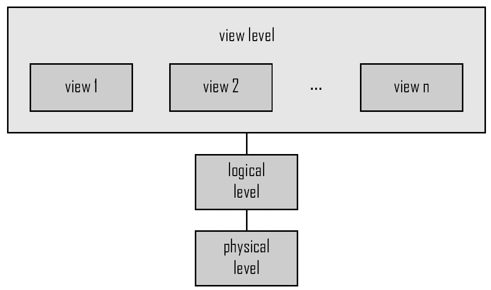

## Data Storage

### Storage Hierarchy

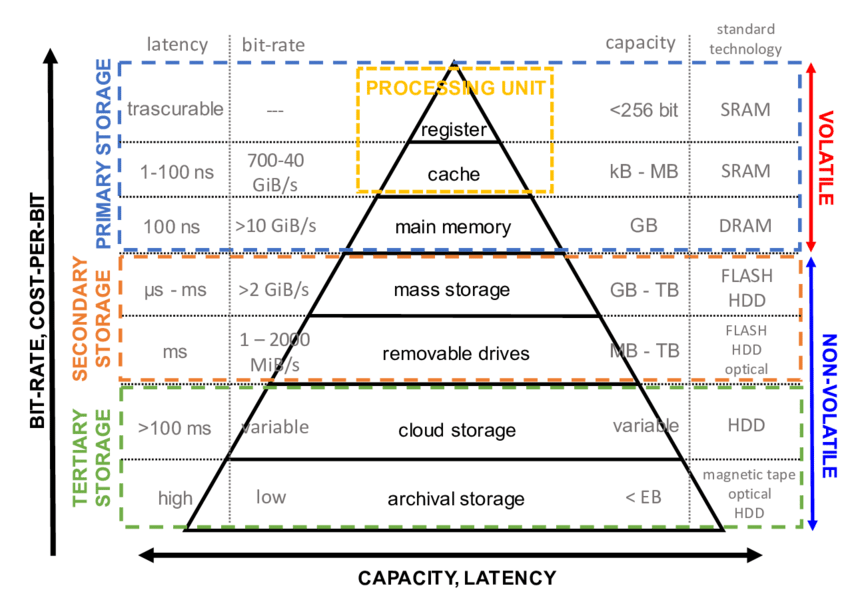

### Primary storage

- cache
    - CPU
    - fastest, most expensive, volatile (nestálý)
- main (operation)
    - RAM
    - too small or expensive for a whole database, volatile

### Secondary storage

- magnetic disk (HDD)
    - large capacity, non-volatile
    - reads and writes of the same speed
        - slow random, fast sequential
    - acces time (čas od požadavku an čtení/zápis do té doby, než se začne provádět čtení/zápis)
        - komponenty: seek time (pohyb hlav na správné místo) + rotational delay (otočení na správné místo)
    - transfer rate (rychlost čtení/zápisu) nižší pro vnitřní stopy 
    - optimalizace HW: cache, algorithms for arm moving minimization
- solid state drive (flash memory)
    - fast reads, non-volatile
    - slow writes (erase first, than write)
    - limited write cycles
    - quiet, low access time and delay
    - more resistant to damage (no moving parts)
    - 4x more expensive than HDD (per GB)
    - NAND chips 
        - SLC (single-level cells) - 1 bit, fastest, highest cost
        - MLC (multi-level cells) - 2 bit
        - TLC (triple-level cells) - 3 bit

### Tertiary storage

- tapes, optical discs
    - for backups 

### Data exchange overview

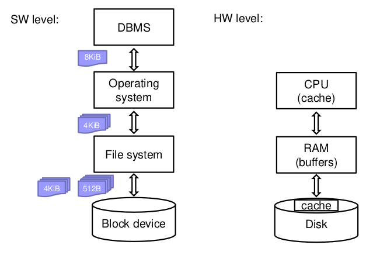

### Přístup k datům

- chceme **minimalizovat random accesses**
- v algoritmech obvykle pro zjednodušení uvažujeme stejnou cenu pro čtení a psaní
- pracujeme s bloky dat
    - **block size**
        - velá block size oproti malé:
            - (+) amortize I/O costs
            - (-) read in more useless data; takes longer to read
        - s nižší cenou paměti jsou bloky větší

#### Metody

- double buffering (app)
    - single - načtu, zpracuji, načtu, zpracuji
        - čas = počet bloků ke zpracování (čas na čtení bloku + čas na zpracování bloku)
    - double - načtu, zpracovávám a zároveň načítám další do druhého bufferu
        - čas = čas na čtení bloku + (počet bloků ke zpracování * čas na zpracování bloku)
            - předpokládáme, že čtení je rychlejší než zpracování
- prefatching (OS) 
    - beginning a fetch operation whose result is expected to be needed soon
- defragmentation (OS) 
    - arrange blocks in the order of processing 
- plan access (HW)
    - elevator algorithm
    - čtecí hlava se pohybuje v jednom směru
    - přeskládáme požadavky na disk tak, aby se to dobře četlo


### Storage organization

- disk array = víc fyzických disků tvoří jeden logický celek
    - větší kapacita, načítáme naráz z víc disků paralelně
    - mirroring
        - zapisujeme na oba
        - čteme z jednoho, takže rychlejší
        - spolehlivost - máme data dvakrát
        - musíme dávat pozor na dependent failures, kdy bychom ztratili data na obou
    - striping
        - data rozdělená na více disků
            - bit level (moc se nepoužívá)
            - block level (n disků, i-tý blok na disku (i mod n)) - block striping
        - paralelizovatelnost dlouhých čtení, redukujeme čas na odpověď 
- **RAID** *Redundant Arrays of Independent Disks*
    - <https://en.wikipedia.org/wiki/Standard_RAID_levels>
    - storage organization technika
    - různé varianty, různé spolehlivosti a rychlosti, používají se i kombinace
    - nenahrazuje zálohování!

#### RAID0
- block striping, non-redundant (no fault tolerance)
- high performance - čteme různá data z různých míst, zrychlení
    - k diskům přistupujeme paralelně, pokud jich máme spojených n, tak tvoří jeden velký n-krát rychlejší celek
- no reduced capacity
- non-increased data availability 
    - když jeden disk selže, tak celý array selže
    - use when data availability not important
        - data can be easily and quickly restored from backup

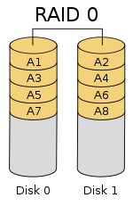

#### RAID1
- mirroring (two or more disks)
- kapacita odpovídá nejmenšímu disku v array
- rychlé čtení (paralelně), psaní stejné jako na jeden disk
- dokud je alespoň jeden z disků ok, tak je array použitelný

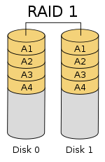

#### RAID2
- bit-striping, Hamming error-correcting code
- recovers from 1 disk failure
    - ale chyba není detekována by the drive!

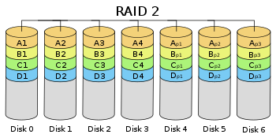

#### RAID3
- byte-striping, 1 parity disk
    - paritu můžeme pro restore využít tak, že uděláme XOR ostatních disků
- errors detected by the drive!
- writing - calculate and store parity
- parity disk (tady i níže) snižuje kapacitu pro celý array

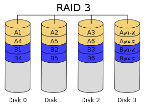

#### RAID4
- block-striping, jinak stejné jako 3
- rychlejší
    - čteme blok vždy z jednoho disku, můžeme paralelizovat
- parity disk is a bottleneck
    - když zapisujeme, musíme tam zapsat
    - zápis - přečteme starý blok a paritu, spolu s novým blokem určíme novou paritu, zapíšeme nový blok a novou paritu

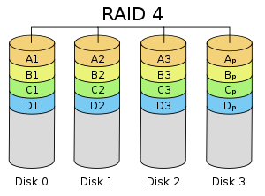

#### RAID5
- block-striping, distributed parity
    - parity block for ¶i¶-th block is on disk $$(\lfloor\frac{i}{n-1}\rfloor \mod n)$$
- rychlejší než 4, může zapisovat paralelně
- nahrazuje 2-4, často se používá

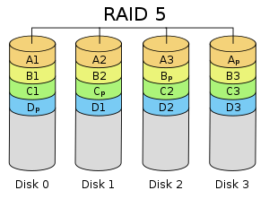

#### RAID6
- dual distributed parity nebo Hamming codes
    - podobné RAID5, ale ukládáme víc informací, takže re umí zotavit ze selhání více disků
- lower speed and performance compared to RAID 5
- less used than RAID5, used for very high-capacity disks

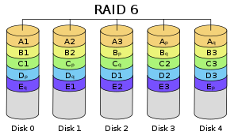

#### RAID combinations
- an array assembled from physical disks, a resulting array built over these arrays
- used to increase performance and reliability
- **RAID0+1**
    - nejprve striping, pak mirroring
    - if two drives (one in each group) fails, the entire RAID 01 will fail

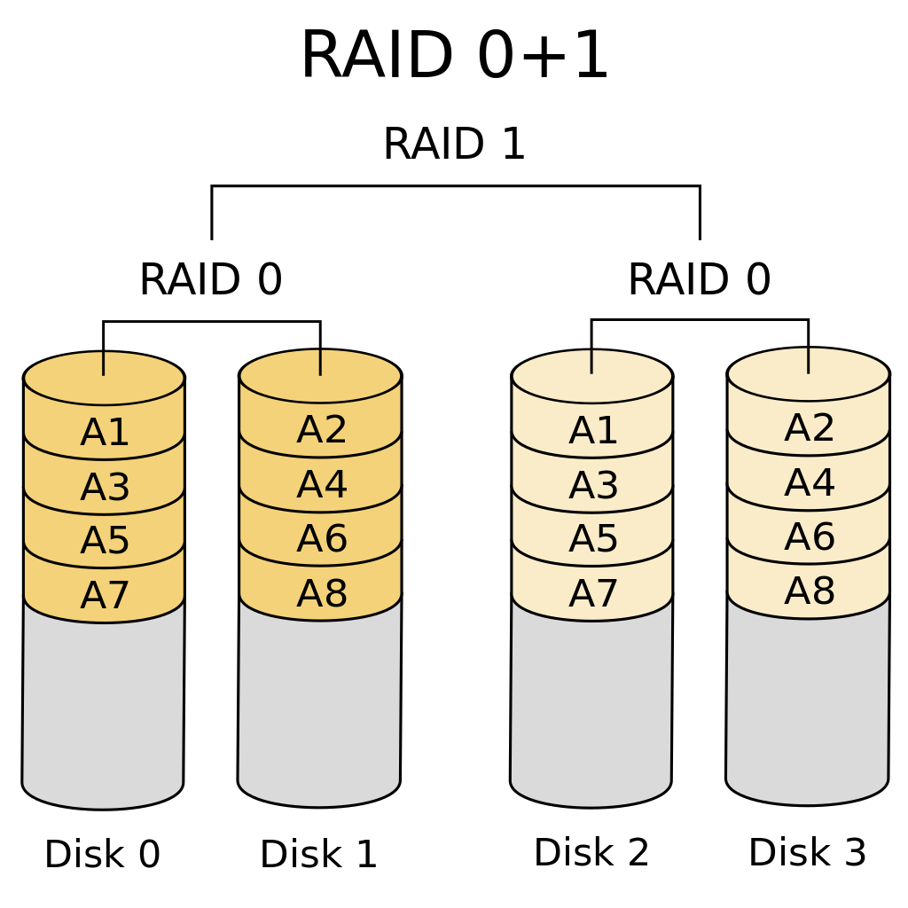

- **RAID1+0**
    - nejprve mirroring, nad mirrored disky striping
    - more resistant to failures - failure of a disk in any RAID1 is OK
    - much faster writing than RAID5
        - for applications with a large number of writes
        - more expensive (menší využití disků)
        
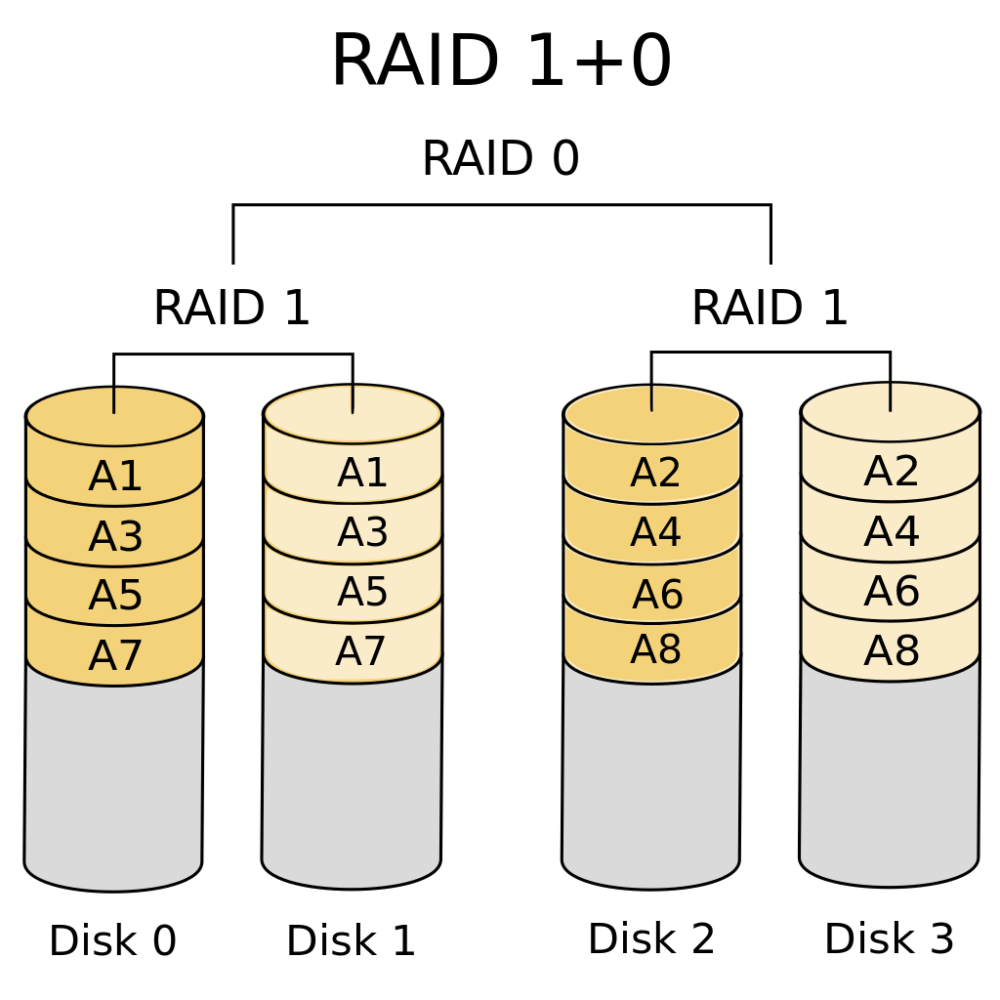

#### RAID over SSD
- SSD issue of wearing - když někam hodně zapisujeme, tak se dané místo opotřebuje
- limiting writes is handled by moving writes to other areas, i.e., wear-leveling
- worse data availability/reliability
    - almost sure that SSDs fail at once
- diff-RAID
    - distributes parity unevenly
    - after replacing a failed SSD with a brand-new one, parity is moved primarily to the most worn-out drive

#### Error Correcting Codes
- parity
- Hamming - parita přes trojice ze čtyř bitů, místo 4 bitů ukládáme 7

.png)

### Failures

- typy failů
    - intermittent (přerušovaný)
        - error při čtení/zápisu, když zopakujeme operaci, tak ok
    - medium defekt
        - premanentí selhání sektoru
        - moderní disky umí detekovat a opravit (alokují volnou kapacitu)    
    - permanent failure 
        - nahradíme disk
- detekce: checksum
- korekce: redundance, error correctning codes
    - disk array, ukládání na víc míst na stejném disku, journal (logujeme modifikace)
- **Mean Time To Failure (MTTF)**
    - jinak: Mean Time Between Failures (MTBF)
    - v hodinách
    - corresponds to failure likelihood
    - average operating time between failures
        - half of disks fails during the period
    - klesá se stářím disků
    - obvykle něco jako 1.000.000 hodin (~120 let)
    - odvozená **Annualized Failure Rate (AFR)** - kolik procent disků failne za rok
        - v praxi roste s rostoucí teplotou (bylo ve slidech)
        - AFR = 1 / (2*MTTF)
    - ještě existuje **Annual Replacement Rate (ARR)**
        - ne všechny failures způsobené vadnými disky (vadné kabely a tak)
        - ve 40% případů se nakonec na vyměněném disku nenajde žádná chyba
            - AFR = 0.6*ARR

#### Failure recovery

- **Mean Time To Repair (MTTR)**
    - čas od failu do doby, než se vrátí k provozu
    - čas na výměnu vadného disku a data recovery
    - zajímá nás pravděpodobnost, že během toho dojde k dalšímu selhání
        - P(failure during repair) = (2*MTTR)/ 1 year
        - předpokládáme, že to bude velmi krátký čas
- **Mean Time To Data Loss (MTTDL)**
    - závisí na MTTF a MTTR
    - pro jeden disk odpovídá MTTF

#### „Write Hole“

- data se nezapíšou na všechny disky
- je možné, že to vůbec nepostřehneme, může se objevit při array reconstruction
- řešení
    - journaling with data written commit message
    - synchronizace array
    - speciální file system

### File Systems

- storing a data block
    1. add an unused block to list of used space
    2. write data block
    3. write file metadata referencing that data block
- moderní file systems používají journaling
    - začátek transakce v journalu
    - uložení 1. až 3. v journalu
    - provedení kroků 1. až 3.
    - konec transakce v journalu

## Representing Data Elements

**Storing Data Elements**
- each element has a type
    - bit interpretation
    - size
    - special NULL value
- usually fixed length 

### Data Element Types

- integer
    - typically sign bit or ones complement
- real numbers
    - floating point numbers - mantissa and exponent
    - fixed decimal point
- boolean
    - usually as an integer, no reason to use less than 1 byte
- data a časy
    - date
        - number of days since “epoch” (e.g., Jan 1, 1970)
        - string YYYYMMDD (8 bytes) nebo YYYYDDD (7 bytes)
        - packed 3-byte integer DD + MM * 32 + YYYY * 16 * 32
    - time 
        - number of seconds (milliseconds, microseconds) since midnight or DD * 24 * 3600 + HH * 3600 + MM * 60 + SS
        - as string HHMMSSFF or as above with fractional part separately
        - time zones - time converted and stored in UTC
    - datetime 
        - year * 13 + month; day, hour, min, sec + fraction 
    - timestamps 
        - seconds since epoch
- enum
    - assign integers to values 
- characters & character sets
    - ASCII - 1 byte
    - pevná nebo proměnlivá délka kódování znaků 
- strings
    - fixed length
        - limited size, shorter strings filled with space, longer strings cut off
    - variable length
        - length plus content, null-terminated (must be read completely) 

### Records

- record = list of related data elements
    - fields, attributes
- length
    - fixed - each record same size
    - variable - saving space, complex implementation, possible to store large data items

#### Record Schema

- describes record structure
    - number of attributes
    - order of attributes
    - data type and name of each attribute
- fixed vs variable schema
    - fixed - same for all records, stored out of record
        -  padding to "convenient" size (faster memory access when address is round to 4 (8) bytes)
        -  schema changes: every record must be updated
    - variable - record itself contains schema
        - useful for: sparse records (many NULLs), repeating attributes, schema changes during DB lifetime 
        - schema changes: only changed records get updated
    - "intermediate" schema 
        - compromise between fixed and variable schema 
        - record "version" in record header
- record header
    - information about the record (fixed length; no relation to attribute values) 
    - record schema version, length, creation/update/access timestamp, bit array of NULL value flags (one bit for each attribute)
- compression
    - increases speed of accessing/updating (fewer bytes)
    - possibilities
        - within record (values independently)
        - collection of records
            - more effective, more complex
- storing objects
    - current commercial DBMS support objects
    - extension of relational DBMS
    - objects have attributes
        - primitive types - stored as records
        - collections - create new relation

#### Storing Relations

- row-oriented - records stored together - klasika, to jsme uvažovali do teď
    - efektivní update/vložení záznamu
    - efektivní přístup k celým záznamům
- column-oriented - values of the same attribute stored together
    - more compact - no padding to 4/8 bytes, easier compression
    - efektivní přístup př. pro data mining
        - načteme jen relevantní atributy, ale všechny jejich hodnoty 

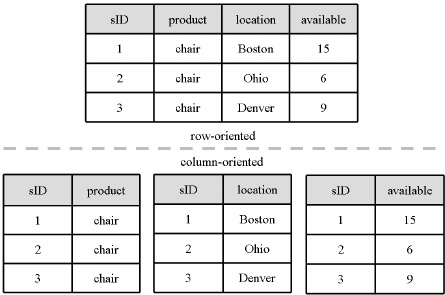

#### Block Organization

- máme záznamy pevné nebo proměnlivé délky a bloky pevné délky, jak budeme ukládat?
- separating records
    - pevná délka - bez oddělovačů, uložíme počet a pointer na první
    - proměnlivá délka - oddělovače, ukládáme v record header délku record
        - délky records můžeme ukládat buď v block header nebo v record header
- spanned vs. unspanned records
    - unspanned - ceý záznam je v jednom bloku, jednoduché, ale zbývá volné místo
        - co s velkými objekty? (binárka/text)
            - uložíme mimo tabulku
            - obvykle neindexováno, nemůžeme koukat na hodnoty
        - možnosti pro dlouhé hodnoty ve sloupcích
            - [The Oversized-Attribute Storage Technique (TOAST)](https://www.crunchydata.com/blog/postgres-toast-the-greatest-thing-since-sliced-bread)
                - *PostgreSQL uses a fixed page size (commonly 8 kB), and does not allow tuples to span multiple pages. Therefore, it is not possible to store very large field values directly. To overcome this limitation, large field values are compressed and/or broken up into multiple physical rows.*
                - how
                    - TOAST table created (chunk_id, chunk_seq, value)
                    - value split into "chunks" identified by (chunk_id, chunk_seq)
                    - original space in table is used to store length of the value, TOAST table id and chunk id
            - komprese
            - rozdělení do více záznamů v tabulce
    - spanned - záznamy mohou být rozdělené mezi více bloků, nutné, pokud jsou dlouhé
        - rozdělení záznamů mezi bloky
            - bloky musí být uspořádané nebo musíme použít pointery 
            - rozdělíme záznam na fragmenty, bit flag "fragmented" v header
                - pointer na další/předchozí fragment

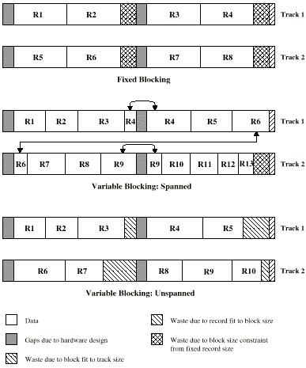

- sequencing
    - řazení záznamů v souboru
    - řazení podle nějaké key value $\to$ sequential file
        - důvod: efektivní přístup, pokud chceme brát podle pořadí klíče
    - solution in DBMS: clustered index 
        - *A clustered index is an index which defines the physical order in which table records are stored in a database. Since there can be only one way in which records are physically stored in a database table, there can be only one clustered index per table. By default a clustered index is created on a primary key column.*
    - sequential file
        - stored consecutively - physically contiguous, prostě jsou ty věci za sebou fyzicky tak, jak mají být seřazené
        - linked - pointery mezi záznamy, jednoduše zařadíme něco doprostřed
        - overflow area - records in sequence (reorganization needed after record modifications), pointer to an overflow area/block
- interlacing more relations 
    - records of multiple tables in one block
        - records of more relations accessed simultaneously
        - store together $\to$ access faster
        - more complex implementation
    - jestli se to vyplatí záleží na frekvenci jednotlivých typů dotazů 
        - občas se vyplatí nemíchat záznamy v blocích, ale uložit bloky blízko u sebe fyzicky na disku
- indirection (pointery na záznamy)
    - aplikace
        - spanned records - rozsekané záznamy mezi bloky, viz výše
        - referencing blocks / record (e.g. in indices)
        - linked blocks (e.g. in indices)
        - objects referencing to other objects
    - adresy záznamu
        - memory address
            - direct addressing, 8-byte pointer in the virtual memory of a process
            - purely physical address in storage
            - not flexible (e.g. block or records reallocation)
        - DB address
            - sequence of bytes describing record location in external memory
            - record / block identified by its ID, map table mapuje ID na fyzickou adresu
                - ID = logical address
            - disadvantages: increased costs (accessing map table, storing map table)
            - advantage: very flexible (deletion/insertion of records, optimization of block storage)
        - combination (phys. record address = phys. block address + position)
            - the position in a list of records within block, at this position, byte-offset to the record is stored
            - advantages: possible to move records within block (no change in phys. address), map table not necessary
            - disadvantages
                - moving record to another block (minor)
                - not flexible in moving blocks (major, defragmentation)
        - combination (record address = file ID + block number + position) 
            - blocks organized by file system, numbered from zero within each file
            - file id, block number $\to$ file system map $\to$ physical block id
            - widely used 

#### Block Header

- in each block
    - file ID (or relation ID or DB ID)
    - block type (e.g. record of type, overflow area, TOAST table, …)
    - block ID
    - record directory (points to record data)
    - pointer to free space (beginning, end)
    - pointer to other blocks (e.g. in indices)
    - modification timestamp/version number

#### Record Modifications

- insertion
    - unordered file
        - append to the end (last block or allocate new)
        - insert into unused space of existing block
            - need to handle variable length of records
    - ordered (sequential) file
        - unfeasible without indirect addressing nor record positions (offsets) 
        - find free space in a “neighboring” block $\to$ reorganize
            - move last record in the block to the next block, put a marker in the original place to point to the new location
        - use overflow block - pointer to an overflow block is in the block header 
- deletion
    - pointer to deleted records must be invalidated, cannot point to new data
        - direct adressing
            - mark as deleted (one bit, in reality several bytes due to memory padding)
            - advertise the free space (linked list of unused areas)
        - indirect adressing
            - mark in the map table, deleted record is freed in the block
            - we can delete row in the map table instead of marking as deleted, but we cannot reuse ID!
        - rec. addr. = block addr. + rec. position
            - uvolníme co zabíral záznam
            - defragmentace aby zbytek navazoval
            - v record directory nastavíme pointer na null
- update
    - same size ok
    - enlarging/shrinking
        - enlarging 
            - within a block - move following records
            - create an overflow block
        - shrinking
            - may free overflow blocks

### Memory Buffers and Pointers

- DB pointer in memory is inefficient
- pointer swizzling - change of DB pointer to memory pointer and back
    - when
        - automatically – immediately after reading
        - on request – on first use/access
        - never – use map table instead
    - implementation
        - DB address updated to memory address, build a translation table
            - store a pair (disk addr., memory addr.) for each record
        - flag (swizzled/unswizzled) in the pointer 


- buffer management
    - DB features needed
        - keep some blocks in memory/cache
    - different strategies
        - LRU: update timestamp on access to block; significant maintenance, but effective
            - approximation - "clock" algorithm: ručička ukazuje na poslední přečtený záznam, rotuje, aby našla blok k zapsání na disk a nahrazení, při čtení nebo přístupu je flag nastavena 1
            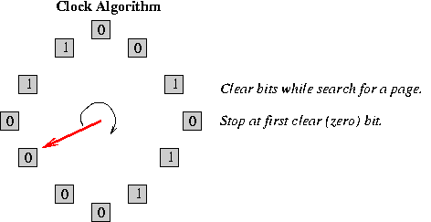
        - FIFO: store time of loading, no update on access; improper for highly accessed blocks
        - pinned blocks: blocks allocated in buffers forever  

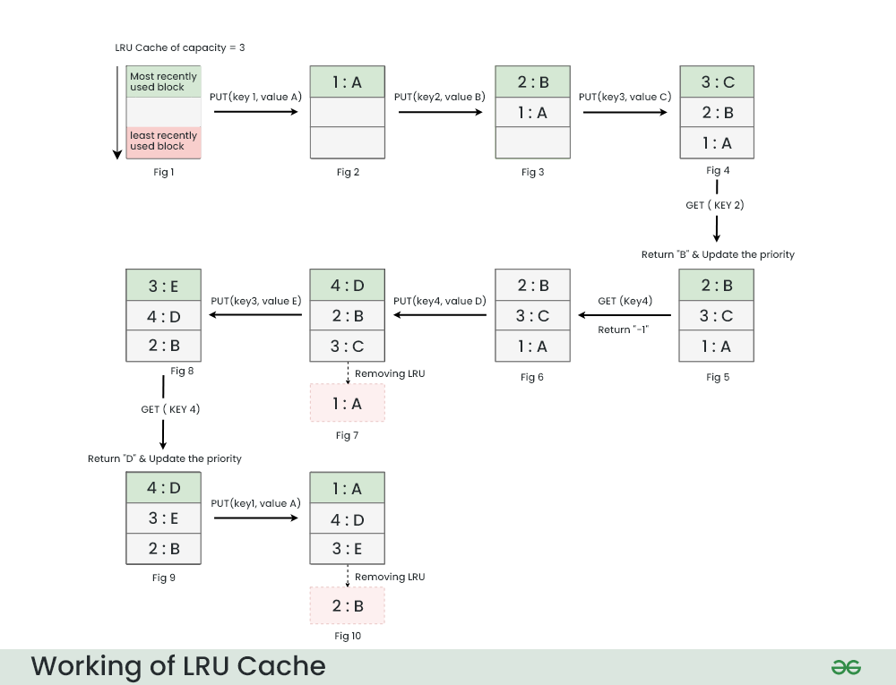

## Indexing

- reason: faster access to records
- variants: indexes, B-tree, hashing

### Terminology

- sequential file = bez indexu

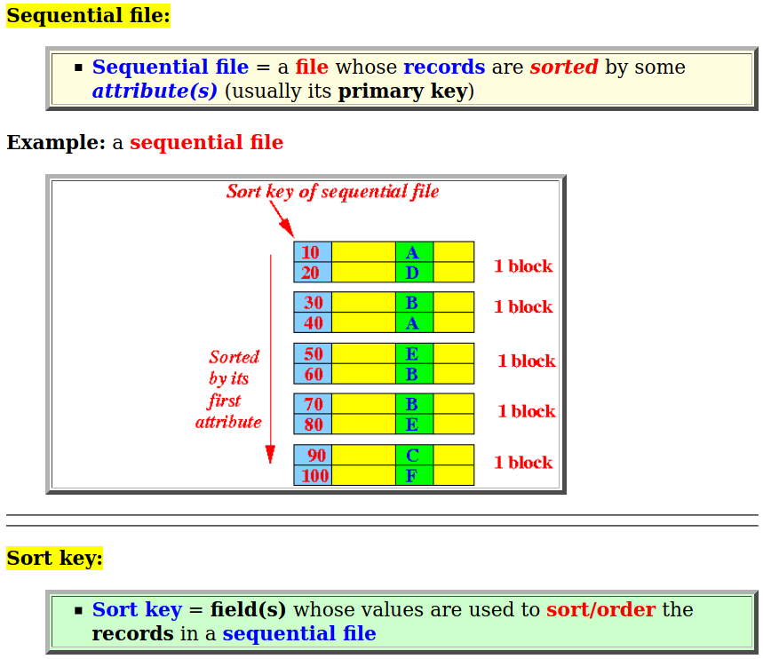

- index-sequential file = sekvenční, ale s indexem

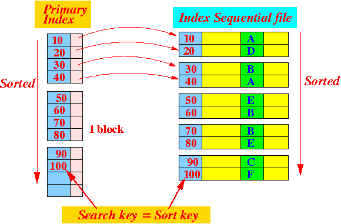

- index = tvar <klíč, pointer to record>
    - primary, secondary
    - dense, sparse
        - dense ukazuje na všechno, sparse jen na něco
    - multilevel
- search key
    - primary key    

### Indices and Pointers

- pointers in indexes
    - pointer to records - block address + record position (index with a block)
    - pointer to block - block address = file ID + block number
    - file is contiguous and sequential
        - may store pointers to blocks
            - use “implicit” pointers, i.e., can be computed
            - e.g. block number derived from the order of items in index

#### How to handle duplicate keys

- dense index
    - co s duplicitami?
        - duplicate values in primary index
        - values in primary index are unique (count how many)
            - ukazují na první výskyt hodnoty
            - files must be sequential

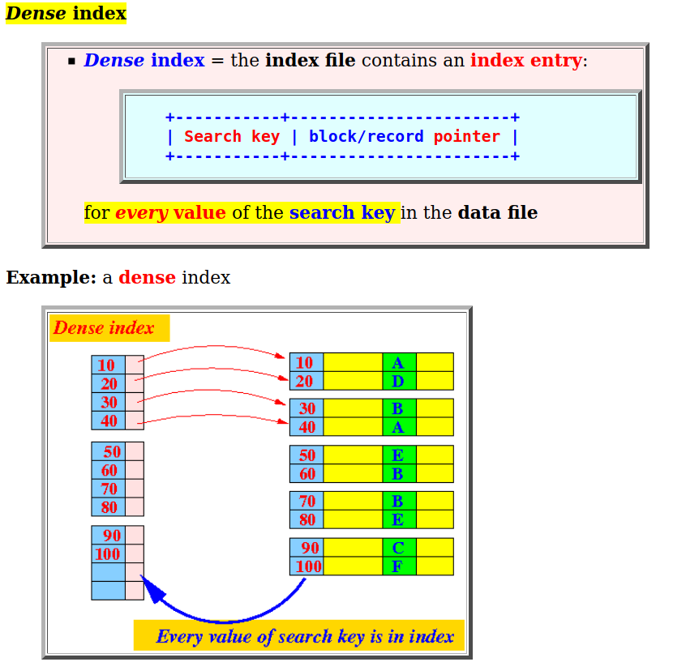

- sparse index
    - pointers with the first value in the block
        - can eliminate duplicate values
    - pointers with new value in block    
        - třeba když v minulém bloku už bylo 10 a tenhle začíná 10, ale pak je tam někde 20, tak pointer na 20

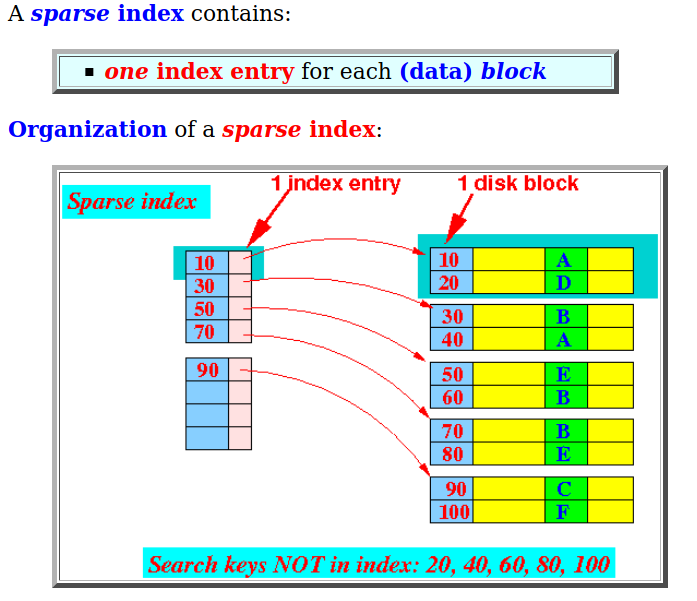

#### Secondary Index

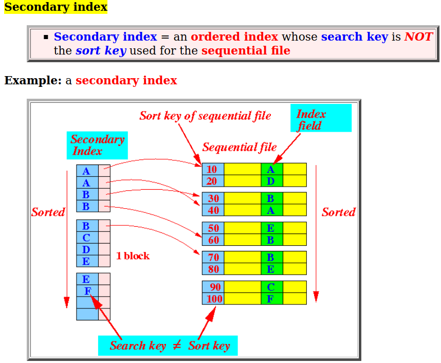

- jiné řazení než podle primárního klíče, nebo když nemáme žádné řazení
- musíme mít pointery na záznamy, protože sekvenčnost už používá primární index
- dense index, sparse for higher levels
- co s duplicitními klíči?
    - co klíč to záznam, zabere hodně místa a trvá dlouho přistupovat
    - index item contains list of pointers, ale to pak máme variabilní délky záznamů v indexu
    - variable-length lists in "buckets"
        - advantage: a list of records for querying
            - evaluate more selection constrains without accessing records
        - souvislost: inverted index in text information retrieval

### Conventional Indexes: Summary

- advantages
    - simple
    - index is sequential too $\to$ good for full scan
-disadvantages
    - costly updates
    - lost of physical "sequentiality" due to overflow buckets

### B-trees

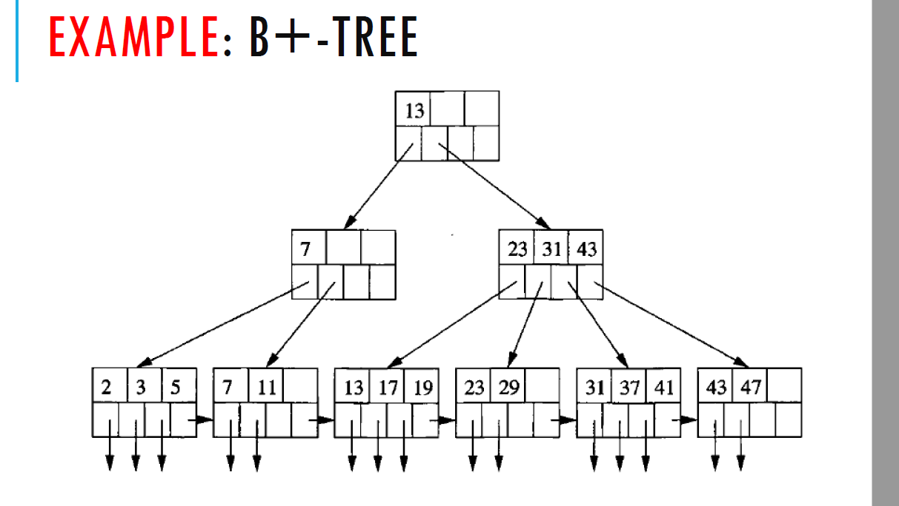

- typicky se myslí B+tree
    - v porovnání s B-tree má pomalejší lookup, ale B-tree má různé formáty pro listy a nelisty a komplikované mazání, tak ho nepreferujeme
- typ indexu
    - ne nutně sekvenční
    - vyvážený - garantuje max I/Os
- parametr n (tree arity)
    - formát uzlu p1|K1|p2|K2...pn-1|Kn-1|pn
    - leaf node
        - všechny listy na stejné hladině
        - pointery pi ukazují na záznamy Ki (data)
        - pointer pn ukazuje na další list (zřetězení listů)
    - non-leaf
        - pi ukazuje na vrchol s klíči K, kde Ki-1 <= K < Ki
- insert/delete viz Průvodce labyrintem algoritmů
- v praxi často není implementováno splývání vrcholů pro delete
    - bývá víc insertů než delete
    - je to složité a má to malý efekt
- as a file - v listech máme samotné záznamy
- duplicitní klíče
    - pointery v listech ukazují na buckety
- variable-length key values (strings)
    - uložíme celé - malá nebo varabilní arita
    - použijeme prefix compression

 **B+tree vs. Conventional index**

 - B+tree
    - má velký overhead
    - dynamický, ale nemusí být sekvenční
    - nevýhoda complex locking
    - lépe organizované
- obyč index
    - musíme přeorganizovat případně celý, nevíme, kdy přeorganizovat
        - oproti tomu B+tree dělá malé lokální reorganizace
- použití pro buffer manager
    - raději B+tree, conventional index – must use overflow blocks to be efficient, linear complexity due to overflow areas

### Hash index


- koncept - key-to-address transformation
    - máme klíč, nacpeme ho do fukce, dostaneme adresu
- direct addressing
    - klíč $\to$ hash $\to$ adresa
    - <https://www.tutorialspoint.com/what-are-hashed-files-and-indexed-file-organization-dbms>
    - typicky adresa bloku, dobré pro hashed file
    - adresa záznamu (record) se používá zřídka
- indirect adressing
    - secondary index, má to overhead
    - klíč $\to$ hash (adresa bucketu) $\to$ bucket obsahuje dvojice <key,pointers> $\to$ pointer ukazuje na blok ve složce
    - address space - collection of buckets
        - bucket - kapacita víc než 1 záznam
            - setřídit?
                - ano, pokud chceme rychlý přístup
                - ano, pokud update zřídka
                - ne při častých updatech
- hash funkce
    - řekněme že klíč je $n$ bytový array, máme B bucketů (1 bucket $\approx$ 1 blok)
    - $h(x_0,x_1,\ldots,x_{n-1})$
        - například součet mod B nebo součet mod B kde sčítance jsou $x_i\cdot 31^{(n-i)}$
    - chceme aby fce byla:
        - uniformní - rovnoměrné zatížení všech bucketů
        - náhodná - malá korelace mezi vstupem a výstupem
    - kolize - když už na spočtené adrese nějaký záznam je 
        - pokud můžeme uložit více klíčů/záznamů, tak není problém
        - pokud přeteče, tak musíme řešit
- **statické hashování**
    - closed addressing (=open hashing)
        - vrácená adresa je fixní, při přetečení alokujeme overflow blok, ty můžeme řetězit
        - používá se pro secondary index
    - open addressing (=closed hashing)
        - máme kolizní funkci - př. lineární, kvadratická, double-hashing
        - used in in-mem hash tables
    - overflows $\to$ reorganization
        - třeba nová hash funkce
- **dynamické hashování**
    - **extendibl**e <https://www.geeksforgeeks.org/extendible-hashing-dynamic-approach-to-dbms/>
        - myšlenka: použijeme jenom i bitů z b bitového výstupu hashovací funkce
            - přidáme indirekci (directory) - size is power of 2
            - když nemáme dost místa, použijeme více bitů a více bucketů
        - výhody: neplýtváme místem, umíme pracovat s rostoucím množstvím záznamů, lokální reorganizace
        - nevýhody: indirekce (nevadí, pokud directory s ukazateli je v paměti), velikost directory se zdvojnásobuje (nemusí se vejít do paměti, počet bucketů roste lineárně)
    - **linear**
        - myšlenka: použijeme suffix, nemáme directory
            - když použijeme 80% bucketů, tak nějaký rozdělíme na 0xxx a 1xxx a rozdělíme obsah a overflow
        - advantages: nemáme directory, jinak ty stejné jako extendible výše
        - disadvantages: overflow
- hashing vs indexing
    - hashing good for exact match like SELECT ... WHERE a=5
    - indexing good for range search like SELECT ... WHERE a>5

### Bitmap (raster) index

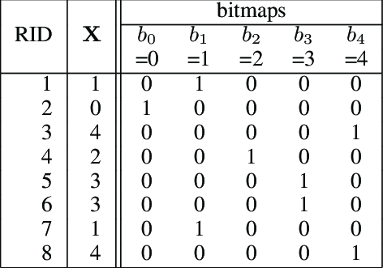

- pro málo možných hodnot atributu
- pro každou hodnotu atributu budeme mít bit-vektor
- hodí se pro dotazy jako WHERE a=5 or a=7
- nevýhody
    - musíme to ukládat 
    - update: 
        - nová hodnota - nový array
        - nový záznam - upravíme všechny arrays
- výhody
    - rychlé bitové operace, můžeme aplikovat i na range queries
    - jednoduché kombinování více indexů dohromady
- komprese
    - obvykle tam je málo jedniček a hodně nul - nuly na konci zanedbáme
    - Run-Length Encoding (RLE)
        - bloky nul následovaných jedničkou
        - blok má délku $i$
        - zakódujeme $i$ v binárce - délka čísla vyjádřená jako samé 1 a na konci 0 + samotné číslo
        - vyplatí se, protože máme dlouhé úseky nul
- implementace
    - jak najít bit-array pro daný klíč
        - B+tree pro klíče, v listech pointery na bit arrays
    - když máme array, jak dostat records
        - jak dostat record r
            - secondary index pro čísla records
            - array pointerů na records
            - list of block occupations in the number of records
    - updating records, jak upravit index
        - fixní record number
            - smazání - značka, že neexistuje, clear a bit in the corresponding array
            - přidání - přidáme na konec a přidáme bit na konec všech arrays
        - not fixed record number
            - moc se nepoužívá, můžeme přeorganizovat všechno
- order of magnitude improvement compared to table scan
- bitmaps are best suited for multiple conditions on several attributes, each having a low selectivity

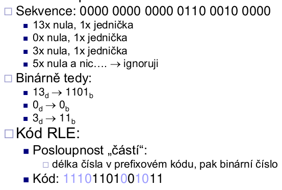

### Multi-key / composite index

- index na více atributech
- alternativy
    - index na jednom atributu a filtorvání
    - kombinace dvou indexů + průnik kandidátních záznamů
    - index v indexu
    - konkatenace dvou hodnot klíčů do jedné
        - indexing - moc se nepoužívá
        - hashing - můžeme použít dvě hashovací funkce a výsledek sloučit do jedné adresy
    - grid index - máme mřížku, na osách dva indexy
        - efektivní pro exact match queries, range queries vedou na obdélníkový výsledek
        - jak ukládat mřížku na disku?
            - jednodimenzionální array - tradeoff: grid dimensions vs. cell capacity
        - nevýhody: dimenze musí být fixované, limitovaná kapacita buňky, musíme vybrat intervaly pro spojité hodnoty
        - výhody: hodí se pro multikey indexing
        - implementace - přidáme indirekce, z buněk tabulky ukazujeme na buckety 

### Další terminologie

- clustered index = index-sequential file / B+file
    - records are stored in leaf nodes and cannot be accessed in any other way than by this index
- non-clustered index = secondary index / B+tree

*A clustered index means you are telling the database to store close values actually close to one another on the disk. This has the benefit of rapid scan / retrieval of records falling into some range of clustered index values.*

- covering index
    - dotaz může být úplně zodpovězen jenom s tímhle indexem
- indexed view
    - materialized view with clustered index

## Query Processing

### Describing Evaluation Plans

- where (selekce): $\sigma$
- natural join: $\bowtie$
- select (projekce): $\Pi$
- cartesian product $\times$

**Příklad**
- select B,D from R,S where R.C=S.C and R.A='c' and S.E=2
- $\Pi_{B,D}[\sigma_{R.A='c' \land S.E = 2 \land R.C=S.C}(R \times S)]$

### Overview on Query Optimization 

- input: SQL query
- parser $\to$ parse tree
- translate $\to$ logical query plan
- rules $\to$ "improved" logical query plan
- estimate sizes $\to$ "improved" logical query plan with sizes
- create physical query plans
- estimate costs of physical query plans
- choose best 
- execute (statistics for next sizes estimation)
- result

### Optimalizace plánu

- transformace musí zachovat ekvivalenci
    - natural join - asociativita a distributivita
    - cartesian product - asociativita a distributivita
    - union - asociativita a distributivita
    - select:
        - $\sigma_{p_1\land p_2}(R)=\sigma_{p_1}[\sigma_{p_2}(R)]=[\sigma_{p_1}(R)]\cap[\sigma_{p_2}(R)]$
        - $\sigma_{p_1\lor p_2}(R)=[\sigma_{p_1}(R)]\cup[\sigma_{p_2}(R)]$
- tuple duplicates 
    - sets or bags? (množina neobsahuje duplikáty, bag ano)
    - SQL is a bag language
    - bag intersection
        - minimum - ve výsledku bude tolik výskytů, kolik je na vstupu méně
    - bag union
        - maximum - ve výsledku bude tolik výskytů, kolik je na vstupu více
        - sum - ve výsledku součet počtů ze vstupu
        - kterou možnost použít?
            - suma pro union, maximum pro disjunctive predicates (or)
    - některá pravidla nelze pro bags aplikovat
        - associativity of except: $R – (S – T)$
        - distributivity: $R \cap (S \cup T) \neq (R \cap S) \cup (R \cap T)$

**Transformační pravidla**

- chceme se vyhnout vnořeným poddotazům - místo IN můžeme použít kartézský součin
- substitution of product and selection by join
- **combining select and natural join**
    - definice
        - $p$ = expr. containing only attrs. of R
        - $q$ = expr. containing only attrs. of S
        - $m$ = expr. containing attrs. of both R, S
    - $\sigma_p(R \bowtie S)= [\sigma_p(R)] \bowtie S$, $\sigma_q(R \bowtie S)= R \bowtie [\sigma_q(S)]$
        - můžeme odvodit další pravidla, třeba $\sigma_{p\land q \land m}(R \bowtie S)= \sigma_m[\sigma_p(R) \bowtie \sigma_q(S)]$
- **combining project and select**
    - definice
        - $x$ = attribute subset of R
        - $a$ = attributes referenced in expr. p (subset of R)
        - $y$ = attribute subset S
        - $z$ = attributes common in R and S
    - $\pi_x[\sigma_p(R)]=\pi_x[\sigma_p(\pi_{xa}(R))]$
    - $\pi_{xy}(R \bowtie S) = \pi_{xy}([\pi_{xz}(R)]\bowtie[\pi_{yz}(S)])$
- **combining select and union**
    - $\sigma_p(R\cup_{sum}S)=\sigma_p(R)\cup_{sum}\sigma_p(S)$
- **combining select and except**
    - $\sigma_p(R-S)=\sigma_p(R)-S=\sigma_p(R)-\sigma_p(S)$
    - můžeme aplikovat selekci na S abychom zmenšili relaci před odčítáním

**Jaké jsou dobré transformace**

- žádná transformace není "vždycky dobrá"/
- obecně chceme co nejrychleji co nejvíc zmenšit množství records, se kterými pracujeme
    - select early
    - project early
- bereme do úvahy indexy
- eliminate common sub-expressions
- eliminate tuple duplicates

### Estimating Cost of Query Plan

- odhadujeme velikost výsledku a počet I/O
- for complex expressions, intermediate results and their stats are needed

**Estimating Result Size**

- keep statistics for relation $R$
    - $T(R)$ – počet tuples in $R$
    - $S(R)$ – počet bytes in each $R$ tuple (udržujeme průměrnou délku, i když maximum může být větší)
        - $S(R,A)$ – length in bytes of values of attribute $A$
    - $B(R)$ – počet blocks to hold all $R$ tuples
    - $V(R, A)$ – počet distinct values in $R$ for attribute $A$
- pro dobrý odhad musíme udržovat statistiky aktuální
- **kartézský součin** $W=R_1\times R_2$
    - $T(W)=T(R_1)\cdot T(R_2)$
    - $S(W)=S(R_1) + S(R_2)$
- **select** $W=\sigma_{attr=val}(R)$
    - $S(W)=S(R)$
    - $T(W)=?$ musíme odhadnout
        - assumption of last estimate
            - $T(W)=T(R)/V(R,A)$ předpokládáme rovnoměrné rozložení možných hodnot atributu (hodnot, které jsme zatím pozorovali)
        - alternate assumption
            - $T(W)=T(R)/DOM(R,A)$ předpokládáme rovnoměrné rozložení hodnot atributu nad doménou s $DOM(R,A)$ hodnotami
        - histogram
            - nahrazuje $V(R,A)$ a $DOM(R,A)$, přesnější odhady
            - few distinct values - absolute number per each
            - many distinct values - quantization
                - ranges (intervals) of equal size (in recs)
                - percentiles
                - focus on most frequent ones only (others i.e. uniformly distributed)
- **select** $W=\sigma_{attr\geq val}(R)$
    - $T(W)=?$ odhad hodnot v mezích
        - calculate fraction of unique values in range
- **select** $W=\sigma_{attr\neq val}(R)$
    - třeba $T(W)=T(R)-T(R)/V(R,A)$, ale obvykle $T(W)=T(R)$
- **select** $W=\sigma_{A=a\lor B=b}(R)$
    - $T(W)=T(R)[1-(1-1/V(R,A))(1-1/V(R,B))]$
- **natural join** $W = R_1 \bowtie R_2$
    - značíme $X$ atributy $R_1$ a $Y$ atributy $R_2$
    - $S(W) = S(R_1) + S(R_2) – S(R_1,Z)$ kde $Z=X \cap Y$
    - pokud mezi atributy není průnik, tak stejné jako kartézský součin
    - předpokládejme, že mezi atributy průnik je
    - assumption of uniform distribution
        - $T(W)=T(R_1)\cdot T(R_2) / max(V(R_1,A),V(R_2,A))$
    - alternate solution
        - $T(W)=T(R_1)\cdot T(R_2) / DOM(R_1,A)$, předpokládáme $DOM(R_1,A)=DOM(R_2,A)$
- **project** $W=\Pi_{AB}(R)$
    - $T(W)=T(R)$
    - $S(W)=S(R,A)+S(R,B)$
- **union**
    - pro union all $T(R\cup S)=T(R)+T(S)$
    - pro max $T(R\cup S)=avg(max(T(R),T(S)),T(R)+T(S))$
- **intersect**
    - $T(R\cap S)=avg(0,min(T(R),T(S)))$
- **except**
    - $T(R-S)=T(R)-T(S)/2$

**Estimate Number of Values**

- při výpočtech výše používáme $V(R,A)$
- pro komplexnější dotazy potřebujeme $V(U,*)$ pro mezivýsledek $U$
- obvyklé řešení 
    - pro $U=\sigma_{A=a}(R_1)$ víme, že $V(U,A)=1$
    - $V(U,K)=T(U)$ pro primární klíč $K$
    - obecně $V(U,*) = min(V(R,*),T(U))$

### Summary

- statistics must be kept up to date for precise estimates
    - necessity to maintain them during table updates
- stats do not change rapidly during time
- inaccurate stats may also help
- instant stats update - can become a bottleneck
    - stats are used very often
- do not update often
- run updates periodically
    - after some time/number of updates
- slow for $V(R,A)$, especially if histograms are kept
    - use data sample
        - if almost all are distinct: assume V(R,A)=T(R)
        - if not many are distinct: we likely saw most of them

## Sorting

- applications
    - on result presentation (ORDER BY)
    - joins
    - filtering duplicates
- assumptions
    - main memory with limited capacity
    - data stored on disk
    - output kept in memory (usually processed by next operations)
    - cost of sorting - number of disk accesses
- existuje hodně třídících algoritmů pro třídění v paměti
- sorting in memory
    - data in main memory
    - sorting in-place, use little additional memory
- small main memory
    - data compression - pracujeme jen s klíči a pointery, ne celými záznamy
        - ok, ale pak musíme data stejně přečíst, aby se s nimi dalo dál pracovat, navíc budeme přistupovat náhodně, ne sekvenčně
    - memory virtualization
        - obvykle moc pomalé
    - modifikace třídících algoritmů
        - zkombinujeme více přístupů, často MergeSort a QuickSort

### Diska-based MergeSort

- vytvoříme úseky takové, aby se vešly do RAM
- každý úsek načteme, setřídíme a zapíšeme zpět na disk
- načteme všechny setřízené úseky a mergneme je
    - mergování v paměti po dvojicích je pomalé, pořád znovu načítáme a zapisujeme
    - multi-way merging
        - read all runs block by block
        - do merging into an output block
        - opakovaně najdeme nejmenší hodnotu ze všech úseků (bloků), zapíšeme do output bloku a když je plný, tak ho zapíšeme na disk
            - když se vyprázdní nějaký ze vstupních bloků z nějakého záznamu, tak načteme další blok stejného záznamu
- omezení - pokud je velikost paměti v blocích M, tak run může být max délky M (abychom ho mohli v první fázi setřídit) a můžeme jich mít max M-1 (abych mohli ve druhé fázi mít z každého jeden blok v paměti a k tomu jeden output blok), nejvíc tedy můžeme mít M(M-1) bloků
    - když to nestačí, rozdělíme na další fáze (třífázové třídění)

## Query Optimization

- generating and comparing query execution plans
- generating: co můžeme využít?
    - transformace z relační algebry (viz výše)
    - existující indexy
    - vytvořit nové indexy a za běhu třídit
- plan cost estimate
    - záleží na ceně každé operace, tedy i její implementaci
    - předpoklady
        - vstup je čten z disku
        - výstup zachováme v paměti
        - CPU cost můžeme zanedbat, protože čtení a psaní na disku je mnohem pomalejší
        - v distribuovaných databázích musíme uvažovat síťovou komunikaci
        - **estimated costs of operation= number of read and write accesses to disk**

### Operation Cost Estimation
- parametry
    - $B(R)$ – size of relation R in blocks
    - $f(R)$ – max. record count to store in a block
    - $M$ – max. RAM buffers available (in blocks)
    - $HT(i)$ – depth of index $i$ (in levels)
    - $LB(i)$ – sum of all leaf nodes of index $i$
- implementace operací
    - založené na konceptu iterátoru
        - open - inicializace
        - getNext - vrátí další záznam z výsledku
        - close - finalizace, uvolní dočasné buffery, ...
    - výhody
        - výsledek není vracen naráz, takže nezabírá hlavní paměť, may not be
materialized on a disk, můžeme použít pipelining

#### Table scan

- relace $R$ není prokládaná
    - reading cost $B(R)$
    - TwoPhase-MergeSort = $3B(R)$ reads and writes
        - final writing ignored
- relace $R$ je prokládaná
    - reading costs are up to $T(R)$ blocks! (pokud v každém bloku máme jeden záznam z $R$ a jinak něco dalšího)
    - TwoPhase-MergeSort $T(R) + 2B(R)$ reads and writes

#### Index scan

- čteme relaci s použitím indexu
- skenování indexu, pokud vyhovuje podmínce, tak teprve čteme záznamy
- výhody: můžeme skenovat jenom část indexu

#### One pass algorithms

- implementace: read relation → processing → output buffers, zpracováváme záznamy jeden po druhém
- projekce, selekce - costs $B(R)$
- agregace (group by) - costs $B(R)$
    - procedura: vytvoříme skupiny pro group-by atributy, uložíme akumulované hodnoty z agregačních funkcí
    - interní struktury
        - zorganizujeme hodnoty grouping atributů (třeba hashováním)
- množinové operace, cross product - costs $B(R)+B(S)$
    - požadavek: menší z relací se vejde do $M-2$
    - menší relace (S) je v paměti, větší (R) se čte po blocích z disku
    - implementace: vytvoříme si dočasnou vyhledávací strukturu (hashování)
    - union
        - přečteme $S$, vytvoříme prohledávací strukturu
            - eliminace duplikátů, hned vrátíme unikátní hodnoty
        - čteme $R$ a pro každý záznam zkontrolujeme jeho existenci v $S$
            - když tam je, tak přeskočíme, když ne, tak ho dáme na výstup a přidáme do struktury
        - limitace: $B(R)+B(S) \leq M-2$ (musí se vejít výstup)
    - intersection
        - přečteme $S$, vytvoříme prohledávací strukturu
            - eliminace duplikátů
        - čteme $R$ a pro každý záznam zkontrolujeme jeho existenci v $S$
            - když tam je, tak ho vrátíme a smažeme z prohledávací struktury
        - limitace: $min(B(R),B(S)) \leq M-2$ (musí se vejít výstup)
    - multiset (bag) operations
        - upravíme ty výše, v prohledávací struktuře si pro intersect udržujeme počet, když klesne na 0, tak prvek smažeme
- eliminace duplicit (distinct) - costs $B(R)$
    - procedura - otestuji, jestli hodnota už je ve výstupu, pokud ne, vrátím daný záznam
    - jak testovat existenci ve výstupu? 
        - uložíme již viděné hodnoty v paměti
            - bez datové struktury můžeme udělat až $n^2$ porovnání, jinak můžeme použít hashování
        - limitace $B(R) < M-1$
- cross product
- natural join
    - předpokládejme relace $R(X,Y),S(Y,Z)$
    - přečteme $S$ a vytvoříme prohledávací strukturu na $Y$
    - pro každý záznam z $R$ najdeme matching records z $S$
        - vrátíme konkatenaci všech kombinací, jenom eliminujeme opakování $Y$

#### Join algorithms

- když se žádná z relací nevejde do paměti
- základní varianta: nested-loop join
    - přečteme jeden záznam z $R$ a všechny z $S$ a tak dokola, costs $= T(S)(1+T(R))$
- block-based nested-loop join
    - čteme po blocích, $R$ – inner relation, $S$ – outer relation, costs $= B(S)(1+B(R))$
- cached Block-based Nested-loop Join
    - přečteme naráz $M-2$ bloků relace $S$, relaci $R$ čteme blok po bloku, join records
    - costs $= B(S)/(M-2)(M-2 + B(R))$
- vždy použít blocked variant
- načíst menší relaci do paměti, pokud $M>>3$
- je důležité, jak jsou záznamy uložené, chceme non-interlaced, protože potřebují jen $B(R)$ I/Os

#### Two-pass algorithms

- procedura: předzpracujeme vstupní relace a uložíme (sorting, hashing), provedeme operaci
- operace: joins, duplicate elimination (distinct), agregace (group by), možinové operace
- **join algorithms – MergeJoin** $R \bowtie S, R(X,Y), S(Y,Z)$
    - preprocessing je drahý, taže se vyplatí až pro fakt velké relace
    - costs
        - MergeSort of R and S: 4(B(R) + B(S))
        - MergeJoin: B(R) + B(S)
    - porovnání složitosti (počítány operace čtení/zápisu na disk) s cached Block-based Nested-loop Join: lineární (MergeJoin) vs kvadratická, takže od určité velikosti relací se to vyplatí
```
setřídíme R a S podle Y
i=j=1
while i<=T(R) and j<=T(S):
    if R[i].Y == S[j].Y: doJoin()
    elif R[i].Y > S[j].Y: j++
    elif R[i].Y < S[j].Y: i++
funkce doJoin():
    while (R[i].Y = S[j].Y) and (i <= T(R)):
        j2 = j
        while (R[i].Y = S[j2].Y) and (j2 <= T(S)):
            output joined R[i] and S[j2]
            j2++
        i++
    j = j2
```
- **join algorithms – SortJoin** $R \bowtie S, R(X,Y), S(Y,Z)$
    - vychází z Merge join, ale není nutné mít relace kompletně setřízené
    - uděláme první část MergeSort, tedy sort runs
    - najdeme nejmenší hodnotu atributu, na kterém děláme join, najdeme odpovídající záznamy a provedeme join
    - in case too many records with the same Y block-nested-loop join in the remaining memory
    - costs
        - Sorted runs: 2(B(R) + B(S))
        - Joining: B(R) + B(S)
    - limitations: run length = M, number of runs < M, B(R)+B(S) < M(M-1)
- **join algorithms – HashJoin** $R \bowtie S, R(X,Y), S(Y,Z)$
    - define a hash function for attributes Y
    - create hashed index of R and S
        - address space is M-1 buckets
    - for each i in [0,M-2]
        - přečteme bucket i pro R i pro S
        - find matching records and join them
    - joining buckets
        - read whole bucket of S (≤ M-2) (may create an internal structure to speed up)
        - read bucket of R block by block
    - costs:
        - create hashed index: $2(B(R)+B(S))$
        - bucket joining: $B(R)+B(S)$
    - limitations: všechny buckety $S$ musí být menší než $M-2$
    - optimalizace - udržujeme nějaké buckety v paměti (HybridHashJoin)
- **join algorithms – Hashing Pointers** $R \bowtie S, R(X,Y), S(Y,Z)$
    - organize pointers to records instead of records themselves
        - store pairs [key value, rec. pointer] in buckets
    - joining - if match, we must read the records
- **join algorithms – IndexJoin** $R \bowtie S, R(X,Y), S(Y,Z)$    
    - předpokládáme index na atributu Y z R
    - procedura: pro každý záznam z S najdeme matches v indexu, každý z nich zkonkatenujeme s původním záznamem a vrátíme
- shrnutí join algorithms
    - cached Block-based Nested-loop Join
        - hodí se pro malé relace
    - HashJoin
        - pokud máme na atributech rovnost, relations are not sorted or no indexes
    - SortJoin
        - good for non-equi-joins, e.g. R.Y > S.Y
    - MergeJoin
        - když už jsou uspořádané
    - IndexJoin
        - když existuje index, může být užitečný, záleží na očekávané velikosti výsledku
- **duplicate elimination**
    - using sorting 
        - první část MergeSort, máme sorted runs na disku
        - čteme je blok po bloku, vždy vrátíme nejmenší hodnotu a přeskočíme všechny stejné
        - costs = 3B(R) jako MergeSort
        - limitations: B(R) <= M(M-1)
    - using hashing
        - rozdělíme R do M-1 bucketů, které uložíme na disk
        - pro každý bucket načteme do paměti, vytřídíme duplicity a zbytek vrátíme
        - costs = 3B(R)
        - limitations: B(R) <= (M-1)^2
- **aggregations**
    - using sorting 
        - stejně jako duplicate elimination, když čteme blok po bloku, tak místo zahození stejných hodnot děláme group, když už projdeme všechny tak spočítáme agregaci
    - using hashing
        - analogicky jako duplicate elimination
- **set union**
    - using sorting 
        - opět sorted runs on disk, tentokrát z R i z S naráz
        - postupně vrátíme všechno, jen přeskočíme duplicity
        - costs = 3(B(R)+B(S))
    - using hashing
        - bucketize R and S (the same hash function, M-1 buckets)
        - process pair of buckets Ri, Si 
            - jeden načti do paměti, druhý blok po bloku
            - potřebujeme eliminovat duplicity - vytvoříme v paměti hash-table
- **set/bag intersection and difference**
    - using sorting 
        - opět sorted runs on disk z R i z S naráz
        - postupně čteme all runs a počítáme výskyty t v S a v R (zvlášť)
        - pro průnik vrátíme t, pokud jsou počty v obou nenulové
        - pro bag průnik vrátíme t tolikrát, kolik je minimum počtů
        - pro R-S vrátníme t pokud je počet v R nenulový a v S nulový
        - pro bag variantu R-S vrátíme t tolikrát, kolik je maximum z #R-#S a 0
        - costs = 3(B(R)+B(S))
    - using hashing
        - bucketize R and S (the same hash function, M-1 buckets)
        - process pair of buckets Ri, Si 
            - pro set intersection (menší relace S) načteme bucket S do paměti a kontrolujeme, co z něj je v R
            - pro rozdíl R-S, abychom eliminovali duplicity v R, tak načteme bucket z R do paměti 

## Query tunning

- local tuning = query rewrite
    - first approach to speed up a query
    - influences only the query
- global tunning
    - index creation
    - schema modification
    - transaction splitting
    - !potentially harmful

### Query Rewriting

**Index usage**

- many query optimizers will not use indexes in the presence of
    - arithmetic expressions
        - WHERE salary/12 >= 4000
        - WHERE inserted + 1 = current_date
        - můžeme přepsat, aby se porovnávalo vždy x = konstanta
    - functions
        - WHERE substr(name, 1, 1) = ‘G’
        - WHERE to_char(inserted, 'YYYYMM') = '201704'
    - numerical comparisons of fields with different types
    - multi-attribute indexes
    - comparison with NULL
- pozor na '=' versus 'like'
    - rovnítko může použít index, like prochází všechno (seq scan)
- pokud používáme aggregate functions, nebo order by s limit 1, nebo obecně nějaké funkce na výsledku, tak je chceme použít až úplně na konci, abychom nenarušili činnost indexů

**Eliminate unneeded DISTINCTs**

- *nemusíme psát distinct, když ta věc, kteoru vracíme, je primární klíč*
- a table T is called privileged if the fields returned by the select contain a key of T
- suppose that R is joined on equality by its key field to some other table S, then we say R reaches S (transitive relation)
- There will be no duplicates among the records returned by a selection, even in the absence of DISTINCT if one of the two following conditions hold: 
    - Every table mentioned in the FROM clause is privileged. 
    - Every unprivileged table reaches at least one privileged table

**Rewriting Nested Queries**

- reason: query optimizer may not correctly handle some nested queries
- uncorrelated subqueries with aggregates
    - example: `SELECT ssnum FROM employee WHERE salary > (SELECT avg(salary) FROM employee)`
- uncorrelated subqueries without aggregate ("semi-join")
    - example: `SELECT ssnum FROM employee WHERE dept in (SELECT dept FROM tech)`
    - pro derived tables obvykle můžeme přepsat s join
    - obvykle subquery ve where
        - semi-join queries may be evaluated efficiently
    - přepsání
        - zkombinujeme, co je ve FROM
        - nahradíme IN za =
        - můžeme mít problém s duplicitami, řešení je udělat dočasnou tabulku a použít DISTINCT
- correlated subqueries with aggregates
    - example: `SELECT ssnum FROM employee e1 WHERE salary >= (SELECT avg(e2.salary) FROM employee e2, tech WHERE e2.dept = e1.dept AND e2.dept = tech.dept)`
    - přepsání
        - vytvoření dočasné tabulky
        - GROUP BY
    - The Infamous COUNT Bug
        - v původním dotazu je count({})=0, takže pokud porovnáváme př. kolik má někdo kolegů a on nemá žádné, tak projde, ale pokud napřed uděláme dočasnou tabulku, tak ne
    - anti-joins
        - example: `SELECT * FROM Tech WHERE dept NOT IN (SELECT dept FROM employee)`
        - problém pokud je v employee.dept NULL
        - `SELECT * FROM Tech WHERE NOT EXISTS (SELECT 1 FROM employee WHERE employee.dept=tech.dept)`

**Use of temporaries**

- pozor, pro dočasné tabulky nemáme indexy

**Use of Having**

- reasons
    - shorter queries that filter on aggregation results
    - cannot use aggregations in WHERE clause
- nepoužívat, když stačí WHERE!

**Use of Views**

- query optimizer replaces the view with its definition

### Aggregate Maintenance

- views nepomůžou
- použijeme temporaries
    - ale musíme je taky updatovat
        - triggers can be used to implement this explicitly
        - můžeme periodicky znovuvytvářet
        - cena update musí být menší než původní cena celého dotazu bez temporaries

**Materialized Views**

- view data content stored in a table
    - automatic updates by DBMS
    - transparent expansion performed by the optimizer based on cost
        - it is the optimizer and not the programmer that performs query rewriting

**Database Triggers**

- a trigger is a stored procedure (collection of SQL statements that executes as a result of an event)
- events
    - insert, update, delete
    - definition of tables, ...
    - time-related events (ne moc časté)
- independent of an application/API
    - executed as part of the transaction containing the enabling event by DBMS
- způsobuje overhead
    - spuštění může být ovlivněno podmínkami, třeba "vždy po updatu ceny aktualizuj", "neaktualizuj pokud se změní jen atribut popis"

### Global (Schema) Changes

- materialized views
    - if refreshed automatically
- creating indexes
- schema change
- relation partitioning

**Using Indexes**

- bez indexu čteme sekvenčně (table scan / seq scan)
    - procházíme všechny záznamy
    - pomalé
- tvorba indexu
    - zrychluje SELECT
    - zpomaluje INSERT, UPDATE, DELETE, protože musíme updatovat i index
        - neplatí, že více indexů je lepších!
        - musíme si rozmyslet, které operace děláme jak často
- optimalizace indexů
    - definujeme si, jaké vlastně provádíme operace (composition of load)
        - analyze log files to find out query types, updates and their frequencies
    - navrhneme různé indexy
        - optimizer estimates costs to evaluate the batch
        - choose a configuration with least costs
- referenční integrita
    - vytvoření cizího klíče nemusí vyvolat indexování atributů klíče
    - foreign keys may slow down deletions drastically
    - příklad: když mažu z tabulky hotelů hotel a jeho id mám v tabulce pokojů u každého jeho pokoje jako cizí klíč, tak musím projít po jednom pokoje a adekvátně je promazat
    - doporučení: create indexes on foreign keys
- reversed-key index
    - specialita Oraclu
    - increases index updates throughput (number of insertions / updates per second)
    - myšlenka: hodnoty klíčů mám uložené obráceně (123 - 321), takže i když je generujeme postupně, tak je ukládáme daleko od sebe a nemusíme čekat na ten jeden blok na konci (diminishes collisions in concurrent index updates) 

**Schema Tuning**

- relation schema - relation name and a list of attributes, their types and integrity constraints
- database schema - schema of all relations
- **Theory of Good Schema**
    - functional dependency A $\to$ B
        - value of attr. B is determined if we know the value of attr. A
    - primary key K
        - K $\to$ R
        - pro žádnou podmnožinu K zvanou L neplatí L $\to$ R
    - schema normalization
        - 1NF - všechny atributy jsou atomické (nemáme v jednom sloupečku víc věcí)
        - 2NF - všechny atributy závisí na celém klíči (můžou tranzitivně)
        - 3NF - všechny atributy závisí přímo na klíči
        - A relation R is normalized if every functional dependency X → A involving attributes in R has the property that X is a (super-)key
- **Practical Schema Design**
    - identifikujeme entity
        - př. zákazník, student, pobočka, ...
    - identifikujeme atributy entit
        - př. adresa, telefonní číslo, číslo OP, ...
        - podmínky: atributy jsou atomické (nemají žádné svoje atributy), entita pevně určuje hodnotu atributu (a functional dependency for each non-key attribute)
    - z každé entity vytvoříme relaci
    - přidáme relace které modelují vztahy jednotlivých entit
    - zkontrolujeme, že je schéma normalizované
- **Vertical Partitioning**
    - je lepší relace Customer(id, address, credit) nebo CustAddr(id, address) a CustCredit(id, credit)?
        - záleží na tom, jaké dotazy a jak často pokládáme
        - pokud je kredit updatován několikrát za den, ale adresu potřebujeme jen jednou za měsíc, tak je lepší druhá možnost
            - relace je menší, méně bloků, možná se vejde do main memory, rychlejší table/index scan
        - dvě relace také lepší pokud jsou atributy velké nebo updatované různě často
        - pokud jsou oba atributy typicky potřeba zároveň, je lepší jedna relace 
            - nepotřebujeme join
- **Vertical Antipartitioning**
    - začneme s normalizovaným schématem 
    - přidáme atributy relace do jiné
    - nevýhody: replikujeme data (dá se omezit)
- **Tuning Denormalization**
    - denormalizujeme schéma výměnou za zrychlení
    - hodí se, když jsou atributy z několika normalizovaných relací hodně často potřeba dohromady
    - nehodí se, když jsou časté updaty
    - alternativa může být Clustered Storage of Relations, ale ne vždy je podporováno
- **Horizontal Partitioning**
    - divides table by its rows (vertical po sloupcích)
    - motivace: menší objem dat ke zpracování, rychlé mazání
    - kdy: data archiving, spatial partitioning
    - přepisování dotazů
        - automatic partitioning - přepisování netřeba
        - manual partitioning
            - DB support - nic přepisovat nemusíme
            - bez DB support - musíme manuálně přepsat dotazy (změnit seznam tabulek ve FROM)
    - partitioning by intervals, enums, hashing, ...
- **Transaction Tuning**
    - transakce
        - aplikační pohled - běží izolovaně, bez konkurenčních aktivit
        - databázový pohled - atomická a konzistentní změna dat, může běžet hodně transakcí naráz (musíme ověřit správnost výsledku)
    - two transactions are concurrent if their executions overlap in time
    - concurrency control
        - kontroluje transakce a zařizuje, že výsledek vypadá, jako by byl získán sériovou exekucí
        - semafor na celé databázi - v jednom čase jen jedna transakce (hodí se pro databáze v paměti)
        - **locking** - good for secondary memory database
            - shared lock pro čtení, exclusive lock pro zápis
            - na úrovni záznamů nebo celých relací/tabulek
            - pravidla
                - transakce musí mít zámek na x předtím, než k němu přistoupí
                - transakce nesmí získat zámek na žádné položce y poté, co uvolní zámek na x
                - zajišťují správnost
                    - nemůžeme updatovat data pokud je zamkl někdo jiný
            - vliv na výkon: když máme víc zámků, je pravděpodobnější, že budeme někde čekat, takže to bude pomalejší
- **Transaction Design**
    - chceme se vyhnou interakcím uživatele v průběhu transakce
    - lock jenom když je to potřeba
    - transakce co nejmenší - pokud dělá transakce dvě nezávislé věci, uděláme z ní dvě nezávislé transakce
    - zeslabíme level izolace (weaken isolation level) 
        - úrovně izolace:
            - serializable
            - repeatable read
            - read committed
            - read uncommitted
            - no locking

## Failure Recovery

- we want data "accurate" or "correct" at all times
- integrity constraints - predicates that data must satisfy
    - consistent state - satisfies all constraints
    - consistent DB - DB in consistent state
    - limits: may not capture "full correctness"
        - examples: transaction constraints - no employee should make more than twice the average salary
    - database should reflect real world, even though some part of “reality” cannot be defined as constraint or DB does not mirror reality
        - DB cannot always be consistent
- solving inconsistencies
    - transaction - sequence of actions (updating data) that preserve consistency
        - předpoklad: když začneme s konzistentním stavem DB, tak skončíme s konzistentním stavem DB
- co může porušovat konzistenci
    - bug v transakci
    - DBMS bug
    - hardware bug
    - data sharing
- prevence 
    - failure model
        - identify possible risks
            - události
                - chtěné - čtěme dokumentaci
                - nechtěné očekávané - memory lost, CPU halts, reset, shutdown, ...
                - nechtěné neočekávané - disk data is lost, memory loct without CPU halt, fire, flooding, ...
        - handle individual component failures
        - přístupy - kontroly, redundance (zálohy)
- failure model - focusing on memory
    - problém: unfinished transactions
- značení pro transakci
    - input(x) - načteme blok obsahující x z disku
    - read(x,t) - načteme x do proměnné t
    - write(x,t) - zapíšeme obsah proměnné t do x
    - output(x) - zapíšeme blok obsahující x na disk
- atomicita
    - brání nedokončeným transakcím
    - buď provedeme celou transakci, nebo nic
    - implementace - logujeme změny v datech
        - transaction produces records of changes into journal
            - system failure: redo/undo changes following the journal
            - recovery from backup: redo changes following the journal

**Undo logging**

- změny v transakci jsou hned propagovány na disk, logujeme původní hodnotu
- když si nejsme 100% jistí, že vše proběhlo správně, tak vrátíme poslední konzistentní stav databáze
- nepraktické, když máme buffer a změny jsou na disk propagovány z něj, tak se může stát, že máme zapsaný commit, ale nastane chyba při přenosu z bufferu na disk 
- pravidla
    - před každým zápisem zalogujeme původní hodnotu
    - předtím, než je x modifikováno na disku (output(x)), log musí být na disku
        - write-ahead logging (WAL)
    - předím, než commit v logu, musí být všechny zápisy na disku
- recovery after failure
    - S je množina transakcí, pro které je v logu start, ale není tam commit ani abort
    - pro každou operaci v logi, v pořadí od nejnovější k nejstarší, pokud je příslušná transakce v S, tak vrátím původní hodnotu proměnné
    - pro všechny transakce v S zapíšu do logu abort
    - failure during recovery není problém, recovery můžeme opakovat

**Redo logging**

- logujeme nové hodnoty proměnných místo původních
- změny jsou uloženy později, poté, co je transaction commit
    - requires storing log records before any change is done to DB
    - můžeme ušetřit nějaké zapisování mezivýsledků na disk
- nedokončené transakce jsou při recovery přeskakovány
- pravidla
    - pro každý write zapíšeme do logu novou hodnotu
    - předtím, než modifikujeme x na disku, musíme mít všechny modifikační příkazy pro x včetně commit v logu na disku
    - pro transakci modifikující x
        - vyplivneme log na disk
        - zapíšeme update x na disk
        - zapíšeme end do journalu
- recovery after failure
    - S je množina transakcí, pro které je v logu commit, ale není tam end
    - pro každou operaci v logu, v pořadí od nejstarší k nejnovější, pokud je příslušná transakce v S, tak zapíšu write(x,v) a output(x)
    - pro všechny transakce v S zapíšu do logu end
    - storing changes by output(x)
        - když máme hodně transakcí s x, můžeme udělat output(x) jen pro poslední record
        - stejně tak end můžeme zkombinovat pro více transakcí
    - je to hrozně pomalé, protože log může jít až rok(y) zpět
        - řešení: checkpoints
            - periodicky opakuj
                - neakceptuj nové transakce
                - počkej, než všechny transakce skončí
                - flush all log records to disk (log)
                - flush all buffers to disk (DB)
                - write “checkpoint” record on disk (log)
                - zase pokračujeme
            - když děláme recovery, tak od posleního checkpointu

**Undo/Redo logging**

- nevýhody předchozích přístupů:
    - zápisy jsou řízené logováním, ne reálným přístupem k datům
    - undo - nezvládneme udržet backup databáze up-to-date
    - redo - musíme všechny modifikace udržovat v paměti až do commitu
- log record contains old and new value of X: <Ti, x, new X val, old X val>
- pravidla
    - page X can be flushed before or after Ti's commit
    - log record flushed before corresponding updated page (WAL)
    - flush log records at commit immediately
- recovery
    - finished (committed) transactions are re-done from beginning
    - unfinished transactions are rolled back (un-done) from end
- non-quiescent checkpoint
    - nezastavíme úplně zpracovávání transakcí, když potřebujeme checkpoint
    - zaregistrujeme aktivní transakce
    - uložíme začátek a konec checkpointu
    - recovery
        - vždy najdeme poslední dokončený checkpoint
        - pro undo se vracíme na začátek transakce
            - vytvoříme množinu commited transakcí, undo všechny transakce, které jsou mezi začátkem checkpointu a koncem logu a nejsou commited (nasledujeme pointery pro active transactions ve startu)
        - pro redo pokračujeme od začátku checkpointu
            - pro všechny commited uděláme redo

**Media Failure**

- RAID
- copies od data
    - 3 kopie, zapisujeme na všechny, čtení formou hlasování, případně čteme z prvního, když fail, tak ze druhého, ...
- DB backup
    - načteme backup a podle logu ho upravíme
        - kdy můžeme zahodit log? po dump, pro undo/redo viz obrázek v prezentaci
- ukládání logu
    - na zvláštní disk
        - sekvenční čtení a zápisy
        - ztráta logu je nezávislá na ztrátě dat

## Advanced topics

### Generování hodnot pro primární klíče

- obvykle monotonně rostoucí sekvence čísel
- řešení 1
    - najdu aktuální maximum a novému záznamu dám max+1
    - nevýhody: když konkurenční procesy, tak nebezpečí, že budeme mít víckrát stejné
- řešení 2
    - jako minulé, ale provedeme nalezení maxima a přičtení atomicky
    - duplicitní hodnoty jsou méně pravděpodobné
    - nevýhody: v závislosti na tom, jak probíhá zamykání, to může zpomalovat
- řešení 3
    - máme tabulku keys(table VARCHAR, id INTEGER)
    - `newid := UPDATE keys SET id=id+1 WHERE table=‘student’ RETURNING id;`
        - potom: `INSERT INTO student VALUES (newid , ‘Mad’, ‘Max’);`
    - nevýhody: zamykání zase zpomaluje (zamkneme vše, provedeme, vrátíme)
    - výhody: když zkombinujeme s 1 (tedy dvě transakce po sobě), tak jsou hodnoty správně a nikdo nečeká
- doporučené použít vestavěné funkce databáze

### Spatial data

- obvykle geografická data, 2D geometrie (čáry, obdélníky, polygony)
- spatial queries
    - What city is at position [Xi,Yi]?
    - What is in neighborhood of 5km from position [Xi,Yi]?
    - What is the closest site to [Xi,Yi]?
    - Is point inside a polygon? Do polygons intersect?
- bez DB podpory
    - jak měřit vzdálenost?
        - můžeme vytvořit vlastní funkci
    - tradiční index na x a y nebudou po některé dotazy fungovat
- quad tree
    - stromová datová struktura, každý vrchol rozděluje prostor na $2^d$ regionů stejné velikosti
        - v listech mohou být body
    - pro komplexnější data než body
        - prvky mohou být ve více regionech, obalené obdélníkem
- mřížka
- R-tree
    - jako B+tree, v d dimenzích
    - listy mohou obsahovat více objektů
    - list is represented by minimum bounding rectangle (MBR)

### Access Control

#### Authorization

- analogy to file systems
    - objects (file, directory, ...)
    - subject (typically: owner, group, others (all users))
    - access right defined on an object O for a subject S (typically: read, write, execute)

#### Privileges

- DB obvykle větší granularita než obyklý file systém
- přístupy se liší pro objekty
    - tables, views, procedures, sequences, schema, database, …
        - views are an important tool for access control
- subjekty obvykle user a group
    - obvykle nazývány *authorization id* nebo *role*
- pro relace/tabulky
    - SELECT: query the table’s content (i.e., list rows), sometimes can be limited to selects attributes
    - INSERT: sometimes can be limited to selected attributes
    - DELETE
    - UPDATE: sometimes can be limited to selected attributes
    - REFERENCES: create foreign keys referencing this table
- views as access control
    - vytvoříme view, kde například vybereme pro zaměstnance vše kromě platu, dáme právo select na view a odebereme ho na původní relace
- grant privilege
    - `GRANT <list of privileges> ON <relation or object> TO <list of authorization ID’s>;`
    - s možností předávat dál: na konec přidáme `WITH GRANT OPTION`
    - odebrat pomocí REVOKE
        - CASCADE - odebere se i všem, komu to dotyčný přeposlal
        - RESTRICT - pokud dotyčný někomu přeposlal, tak fail a musí se řešit jinak

#### Stored Procedures
- user-defined program implementing an activity
    - examples: factorial computation, distance between GPS coords, inserting rows to multiple tables, ...
- příklady: spočtení průměrné mzdy bez toho, aby uživatel viděl mzdy jednotlivých zaměstnanců
- procedury mohou být spouštěny v různém kontextu
    - INVOKER – run in the context of user that calls the function (typically current user)
    - DEFINER– run in the context of the owner of function
    - [particular user] – run in the context of the selected user

#### Attacks to DB system
- přes síťové připojení
    - otevřený DB port - použij firewall
- přihlášení
    - slabé heslo
    - žádné omezení uživatelů, kteří se mohou přihlašovat
    - použití jen jednoho generického admin účtu
- SQL injection
    - attack by sending SQL commands in place of valid data in forms
    - typically related to using only one (admin) DB account
    - do stringu na vstupu "blabla'; zlý příkaz; ---'" (na konci komentář)
    - řešení - uživatelské účty s osekanými právy, kontrola vstupních hodnot, použití funkce na převedení do stringu, předpřipravené statementy (nemusíme mít argumenty mezi uvozovkami)

## Replication and High Availability

*High availability (HA) is the ability of a system to operate continuously without failing for a specified period of time.*

**Determining Availability**

- hours of operation
    - business hours vs. all of the time
        - je rozdíl, pokud má systém běžet jenom v "otevírací době", nebo jde o webovou službu se zákazníky po celém světě, která musí být k dispozici pořád
- connectivity requirements
    - jak moc je aplikace provázaná s databází
        - synchronous vs. asynchronous data updates
    - online vs. offline
- **definice dostupnosti pomocí operating hours**
    - availability = (total time - down time) / total time
- down time
    - plánovaný - reboot, upgrade
    - neplánovaný - HW/SW failure, network unavailability, power outage, disasters, ...
- for "true" high-availability, down time is not distinguished
- **nines**
    - class of nines: $c = \lfloor -\log_{10}(1-Av)\rfloor$
        - availability as percentage of uptime

**Scalability**

- providing access to a number of concurrent users
- handling growing amounts of data without losing performance
- acceptable latency
- vertical scaling (scaling up)
    - increaring RAM
    - mutliprocessing
    - vendor dependence
- horizontal scaling (scaling out)
    - server federations / clusters
    - data partitioning (sharding)
        - the data is partitioned and stored separately
        - master-master model
            - one machine is master for a subset of data, slave for the rest
    - replication
        - the same data stored in more nodes
        - master-slave model
            - load-balancing of read-intensive queries
            - master node: manages data, distributes changes to slaves
            - slave node: stores data, queries data, no modifications to data
    - Need for Distributing Data
        - brings data closer to its user
        - allows site independence
        - can reduce conflicts during user requests
        - process large volumes of data
    - systems are distributed across multiple machines or nodes
        - commodity machines → cost effective
        - often surpasses scalability of vertical approach
    - klamy distribuovaných výpočtů: předpokládáme, že síť je
        - spolehlivá, bezpečná, homogenní
        - topologie se nemění
        - cena za latenci a transport je nulová
        - bandwidth je nekonečná
    - **Replication Types (for “real” multi-master model)**
        - distributed transactions - lower autonomy, lower latency, high consistency
            - for “real” master-master model, ensures consistency
        - transactional replication - minimal latency (typically online)
            - replication of incremental changes
            - conflicts solves using shared locks
        - snapshot replication
            - periodic bulk transfer of new snapshots of data
            - data changes – substantial but infrequent
            - slaves are read-only
            - high latency acceptable
        - merge replication - higher autonomy, higher latency
            - autonomous changes to replicated data are later merged
            - does not guarantee transactional consistency, but converges

**Brewer’s CAP Theorem**
- Consistency: After an update, all readers in a distributed system see the same data. All nodes are supposed to always contain the same data (e.g. in multiple instances, all writes must be duplicated before write operation is completed).
- Availability: Every request receives a response about whether it was successful or failed
- Partition Tolerance: System continues to operate despite arbitrary message loss or failure of part of the system.
- *Only 2 of 3 guarantees can be given in a “shared-data” system.*
- examples
    - ACID
        - Availability and Consistency
        - e. g. replication with distributed transactions
    - BASE
        - Availability and Partition Tolerance
        - e.g. sharding with merge replication

**Maintaining High-Availability of DBMS**
- Standby server
    - Shared disk failover (NAS)
    - File system replication (DRBD)
    - Transaction log shipping
    - Trigger-based replication
    - Statement-Based Replication Middleware
- Log-shipping Standby Server (warm standby)
    - primary node
        - obsluhuje všechny dotazy
        - permanentně archivuje
            - continuous sending of WAL records to standby servers
    - standby server
        - neobsluhuje žádné dotazy
        - in permanent recovery mode
    - log shipping can be synchronous/asynchronous
    - nevýhody: všechny tabulky replikovány
    - výhody: nemusí se změnit schéma, nemusíme definovat žádné triggery
    - když failne standby, tak se nic nestane
        - po návratu zase zálohuje
    - když failne primární, začne pracovat standby
        - aplikuje všechny čekajicí WAL záznamy
        - prohlásí se za primární
        - začne obsluhovat dotazy
        - když se primární zase nahodí, tak je mu oznámeno, že už není primární, typicky se stane sekundárním
    - primární a sekundární můžeme pravidelně střídat, abychom věděli, že recovery funguje