# 8. Vizualizace

> [Základní metriky pro hodnocení kvality vizualizace (efektivita a expresivita)](#expresivita-vs-efektivita), [osm základních vizuálních proměnných](#8-základních-vizuálních-proměnných). Základní vizualizační techniky pro [1D](#1d-data), [2D](#2d-data), [3D (explicitní a implicitní reprezentace povrchu)](#3d-data). [Techniky pro vizualizaci multidimenzionálních dat (paralelní souřadnice, RadViz, scatterplot matrices)](#multivariate-data) a [hierarchických struktur (treemaps, dimensional stacking)](#stromy-grafy-sítě). [Základní třídy interakčních technik (fisheye, perspektivní stěny), specifika aplikace interakčních technik v prostoru samotných dat a v prostoru jejich atributů.](#interakce) (PV251)

## Úvod 

"Displaying a given information using a graphical representation."

- proč?
    - prezentovat data tak, abychom podpořili schopnost adresáta získat vhled
    - doručit informaci
    - pomoci interpretaci dat
    - získat pozornost
- výzkum
    - jak lidi vnímají (vizualizace)
    - vymyslet techniky, jak vizualizovat, aby se to lidem dobře vnímalo
- pozor, vizualizace mohou snadno manipulovat adresáta, to nechceme dělat
- historie
    - už jeskynní malby jsou vizualizace
    - Florence Nigthingale
    - umírání Napoleonových vojáků
- dnes důležité pro medicínu, mapy, miproskpii, abstraktní data, ...
- vztah s grafikou:
    - grafika dělá obrázky a 3D objekty (chce realistické výsledky)
        - pipeline: modelování, view, clip, odebrání neviděných povrchů, projekce, rendering
    - vizualizace se zaměřuje na to, jak zobrazit data (doručení informace)
        - pipeline: příprava dat, selekce, mapování dat na vizuální prvky, parametry scény (př. barevná škála), rendering

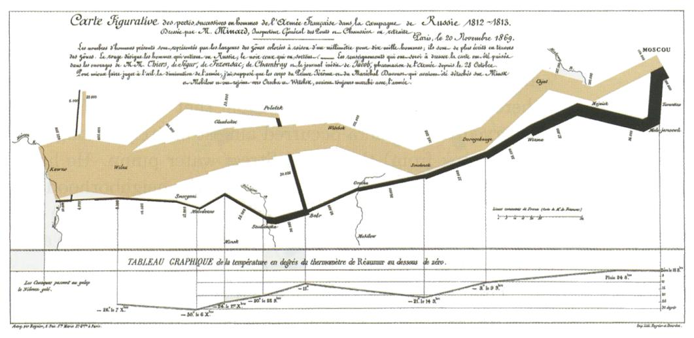

## Lidské vnímání

- zrak se dá snadno zmást, viz optické iluze
    - u vizualizace chceme jasně zdělit informaci, takže tohle nechceme
- hodně čerpáme ze zkušenosti
- barvy
    - důležité, strhávají pozornost
    - musí být snadno odlišitelné
        - mělo by jít nastavit, protože poruchy barevného vnímání jsou časté
    - barva vs odstín
- textura
    - pravidelnost, směrovost, kotrast, velikost, hladkost
    - Chernoff faces - tváře mají různé vlastnosti podle různých atributů dat, když jsou vedle sebe, tak tvoří texturu
- pohyb
    - vibrace, blikání, směr, rychlost
    - můžeme využít k upozornění na část vizualizace a získání pozornosti
    - vnímáme jinak pohyb před námi než periferně

## Vstupní data

- mohou být generována dopředu nebo za běhu vizualizace
    - podle toho typy vizualizací:
        - pasivní: data jsou vygenerována, vykreslena, uživatel se dívá
        - interaktivní: data jsou vygenerována, vykreslena, uživatel může něco měnit, třeba vybírat, co chce zrovna vidět
        - interactive steering: data jsou generována a kreslena naráz, uživatel může měnit, co se generuje
    - seřazené od nejméně po nejvíce infomativní a náročné
- data jsou hlavní část, ale musíme taky komunikovat s uživatelem, co chce, nejen "něco kreslit"
- data raw nebo preprocessed
- dato se skládá z nezávislých a závislých proměnných
    - nezávislé (= doména) - př. čas, místo
    - závislé (= range) - př. teplota
- ordinální vs nominální
    - ordinální a nominální ranked jdou řadit, měli bychom vizualizovat tak, aby šly řadit
    - nominální kategorická řadit nejdou, měli bychom je vizualizovat tak, aby k tomu nevybízely (tj. nepoužívat k jejich odlišení například velikost)
    - škálování
        - existuje absolutní 0?
        - jdou počítat vzdálenosti mezi záznamy?
- příklady reprezentace dat 
    - diskrétní neseřazené - koláčový graf
    - diskrétní seřazené - boxplot
    - spojitá - linechart
    - 2D spojitá - barvy, plocha ve 3D, vrstevnice
    - 2D matice - hedgehog plot, line integral convolution
    - 3D flow - streamlines, streamsurfaces
    - prostorová data - isosurfaces, volume rendering
    - vícedimenzionánlní - paralell coordinates
- struktua dat
    - skalár - věk
    - vektor - souřadnice 2D, 3D
    - tenzor
    - čas
    - topologie - co je s čím spojené
- typy dat
    - 1D, 2D, 3D, nD, stromy (hierarchie), sítě (grafy), časové řady

## Preprocessing

- chceme zobrazit původní data bez modifikací, abychom neztratili infomaci, ale občas to nejde
- techniky níže slouží ke zefektivnění vizualizace, ale musíme informovat, že jsme je použili

### Techniky

- metadata, statistika
    - outlier detection, cluster analysis, correlation analysis
- řešení chybějících a vadných hodnot
    - odebrání neúplných, doplnění nul, doplněnní NA, doplnění průměrné hodnoty, interpolace, dopočítání chybějící hodnoty
- normalizace
    - mapování na interval [0,1]
- segmentace
    - máme diskrétní či spojité hodnoty a chceme z nich udělat úseky
    - př. MRI (256 možných hodnot hodnot na voxel) na tkáň/kost/...
    - algoritmus "split-and-merge"
        - merge podobné (př. podobný průměr)
        - split nehomogenní (př. multimodální distribuce - histogram)
- sampling a interpolace
    - př. chceme zvětšit nebo zmenšit obrázek
    - interpolace
        - lineární, bilineární, nelineární (splines - př. Catmull-Rom)
    - resampling
        - subsampling - část zahodíme, ztratíme informaci
            - lepší průměr sousedů nebo tak
        - data subdetting - zobrazíme jen část dat naráz
            - můžeme dát na výběr uživateli, pak ale musíme mít vše v paměti
- redukce dimenzí
    - ručně vybereme jen některé
    - konverze dat na vektory - hodí se, pokud třeba máme mezi daty nějakou podobnost
    - PCA
    - multidimensional scaling (MDS)
        - gradient descent approach
        - chceme najít reprezentaci s méně dimenzemi, která co nejépe zachovává vzdálenosti bodů
        - často se napřed spustí PCA a pak až tohle

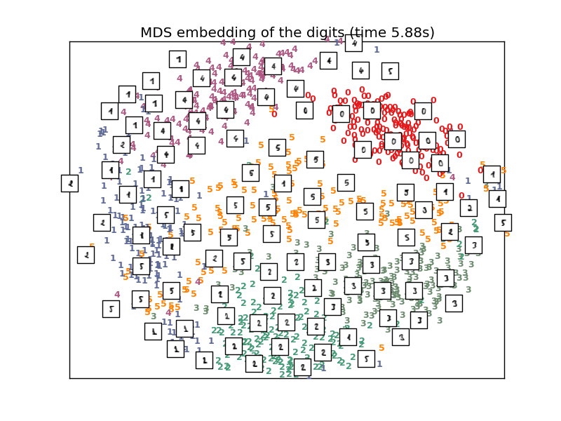

- agregace / clustering
    - K-means
    - iteratice split and merge
    - popsat vytvořené clstery jen jedním bodem není dost, uživatel musí mít přehled o celkové struktuře
- vyhlazování a filtrace
    - př. signal processing
    - chceme odebrat šum a zachovat to důležité
    - obvykle se použije konvoluce
- rastr na vektor
    - proč? je to úspornější na paměť, lepší porovnání komplexnějších věcí v obrázcích, snadnější transformace (rotace, škálování, ...), snadnější segmentace
    - jak?
        - thresholding - získáme plochy
        - region growing - seed, pak merg podle podobnosti (problém: definice podobnosti)
        - boundary detection - konvoluce 

## Základní principy vizualizace

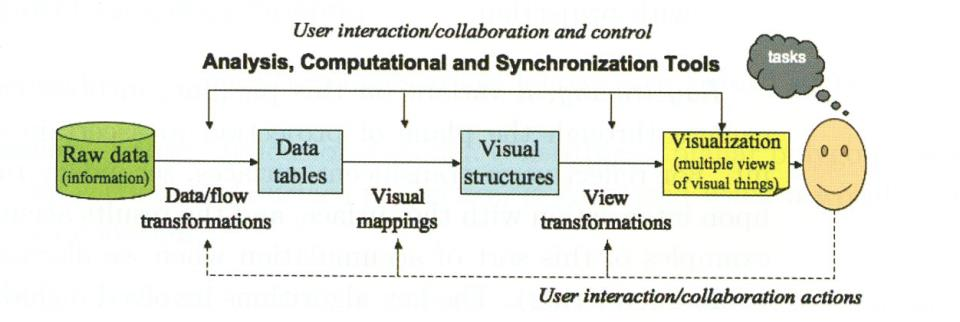

- pipeline
    - zdroj dat $\to$ tabulky $\to$ vizuální abstrakce $\to$ pohledy, kdekoliv v procesu může uživaltel interagovat (na bodech i šipkách), šipky "many-to-many"
- grafické symboly (šipky, labely, značky)
    - semiologie
    - často využíváme předchozí znalosti a zkušenosti - př. dopravní značky
    - detekce vzorů a vztahů v "obrazu"
        - každý vzor v obrazu by měl odpovídat vzoru v datech, jinak jde o rušivý prvek
        - pokud na obrázku vidíme nějaké uspořádání, mělo by být i v datech, jinak ruší vjem
    - když vnímáme složtější obraz, tak nejprve prvky, pak vztahy (kognitivně)
        - prvky vnímáme hned, podvědomě
        - některé vlastnosti prvků vnímáme rychleji - barva vs tvar
- dimezionalita ve 2D grafice
    - můžeme zobrazit víc než dvě dimenze (velikost a barva symbolů, ...), ale musíme myslet na to, že prvky mají být rozlišitelné
- formalizace
    - Sémiologie Graphique, 1967 Jacques Bertin
        - separace obsahu (informací, které chceme zakódovat) a přenosového média (použitý grafický systém)
        - grafický slovník:
            - značky - body, přímky, plochy
            - pozice - dvě dimenze, xy
            - další - velikost, textura, barva, ...

### Expresivita vs efektivita

- **expresivita** $M_{exp}$ - jak moc informace (libovolné) je ve vizualizaci
    - podíl zobrazené informace a informace, kterou chceme komunikovat
    - $M_{exp}=1$ - ideál
    - $M_{exp}<1$ - ukazujeme méně, než chceme komunikovat (nekompletní)
    - $M_{exp}>1$ - ukazujeme více, než chceme, může to být chybné a kazit vnímání toho, co jsme chtěli ukázat
- **efektivita** M_{eff} - "cena za přenesenou informaci"
    - efektivní = rychle se to renderuje a správně a rychle to interpretujeme
    - $M_{eff} = 1/(1 + t_{interpret} + t_{render})$

### 8 základních vizuálních proměnných

- **poloha**
    - prostorové rozložení je to první, co z vizualizace vnímáme
    - každý symbol chcmeme namapovat na unikátní pozici, zároveň tam ale nechceme moc volného místa mezi nimi - kolik toho můžeme zobrazit je tedy omezeno i rozlišením displeje, miliony bodů se tam prostě nevejdou
    - záleží, jaké promněnné si vybereme jako osy - př. pokud mezi nimi je lineární vztah, tak v grafu je vidět a v barvě méně
    - škálování os - lineární, logaritmické
    - osy jsou užitečné, i když ne všude musí být
    - poznámky k vnímání hloubky
        - objekty schované za jinými
            - problémy, když chceme interakci na výběr objektů
        - zobrazování labelů
            - musí být vidě, jít přečíst, směřovat ke "kameře"
        - občas lepší víc grafů s různými pohledy než vše do jednoho
        - 3D dává smysl, pokud máme 3D data, jinak většinou spíš ne
- **tvar**
    - měly by být dostatečně rozeznatelné
    - nebavíme se o barvě, orientaci, velikosti, ...

*(poloha a tvar jsou zásadní, zbytek je pomocný)*

- **barva**
    - vidíme ji hned
    - definována pomocí hue (odstíny) a saturation (kolik barvy a kolik šedé)
    - dá se použít pro diskrétní i spojité veličiny
    - rainbow scale - problémy: neuniformí, umělé předěly
        - proč se to tedy pořád používá? hezky se na to kouká, poutá to pozornost
            - pokud bychom použili jen jednu barvu a měnili jas, tak se zase blbě čtou jednotlivé hodnoty
- **velikost**
    - společný rámec pomáhá přesnosti vjemu
    - pokud je velikost kódována jako šířka čáry, můžeme použít jenom velmi limitovaný počet možností
    - perspektiva ničí vnímání velikosti
- **jas**
    - vnímání je limitované, škála by měla být lineární
- **orientace**
- **textura**
- **pohyb**

## Vizualizace dat v prostoru (spatiotemporal data)

- první musíme rozhodnout, který atribut namapujeme na pozici na obrazovce (ty ostatní pak na barvu, tvar, ...) a jak
    - škálování, rotace, zkosení, ...

### 1D data

- osa x, pak buď y nebo třeba barva
- multivariate data - osa x a více hodnot na y
    - juxtaposition - víc grafů vedle sebe
    - superimposition - víc grafů do sebe

### 2D data

- obrázek (fotka, rentgen, ...)
- rubber sheet - surface 
    - každý z 2D bod má výšku, uděláme triangulaci a povrch
- cityscape - 3D bloky na mapě, perspektiva
- scatterplot -  není tam interpolace, další vlastnosti dat barva, tvar, ...
- mapa
- kontury, vrstevnice
- juxtaposition - víc 2D grafů do 3D
- superimposition - víc grafů do sebe - př. reliéf s průhlednými plochami
- taky můžeme z dat udělat 1D a pak zobrazit to
    - freq. histogramy
    - slučování řádků a sloupců v obrázku
        - součet, průměr, odchylka, max, min, ...
    - lineární sonda

### 3D data

- explicitní plochy
    - vrcholy ve 3D, hrany mezi nimi, polygony definované pomocí hran
    - parametrické rovnice definující souřadnice bodů na ploše v prostoru + strategie, jak body spojit
- objemová data (voxely)
    - slicing, potom 2D nebo 1D
    - vrstevnicové plochy - pak explicitní plochy
        - převod pomocí marching cubes
        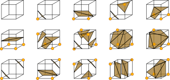
            - pro každý roh definováno, co se má stát, pokud je hodnota pod/nad prahem
            - problémy - můžeme mít díry v povrchu, zabírá to hodně místa
    - přímo renderujeme objem
        - forward mapping
            - promítneme každý voxel na projekční rovinu a určíme, které pixely budou jak barevné
            - problémy: co s pixely ovlivěnými více voxely, co s pixely na které se nenamapovaly žádné voxely, co s tím, když jsou voxely často namapovány mezi pixely
        - ray casting
        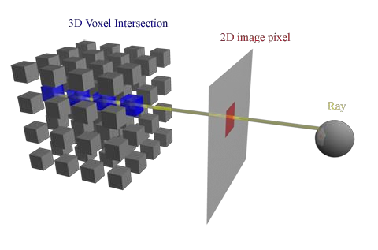
            - vyšleme paprsek z každého pixelu projekční roviny přes objemová data, kde se protíná s jakými hodnotami určí výslednou hodnotu
            - problémy: jak vybrat množství bodů, které budeme samplovat v průběhu paprsku, jak spočítat hodnotu tam, kde často padneme mezi voxely, jak pak hodnoty zkombinovat
        - řešení některých problémů: každý pixel má hodnotu "transparentnost", pro forward mapping mapujeme více pixelů na více voxelů (váženě)
    - resampling hraje důležitou roli
    - cutting planes
    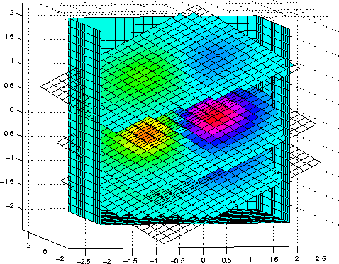
        - pokud není paralelní s nějakou osou, tak musíme řešit mapování voxelů na pixely - nejbližší, vážený průměr z blízkých, ...
        - na specifikaci potřebujeme 6 parametrů, 3 poziční a 3 na normálu
        - varianty - neplacaté řezy, sekvence řezů různých orientací, ortogonální řezy
- implicitní plochy
    - zero contour funkce
    - složité, ale dobrý výsledek
- kombinované techniky
    - řezy + vrstevnicové plochy
    - plochy a markery/glyfy

## Geodata

- klima, telefonní hovory, platby kartou, ... cokoliv, kde nás zajímá, kde na světě se to dělo, zobrazujeme na mapu
- mapa - zjednodušené zobrazení světa, body, čáry, plochy
- co chceme zobrazovat 
    - body, čáry (linie), plochy, povrch (2.5D)
- typy map podle vlastností zobrazených dat
    - symbolické (nominální bodová data)
    - bodové (ordinální bodová data)
        - pozor na moc husté a překrývající se body
    - land-use (nominální plošná data)
    - colorpleth maps - nějaký fenomén v dané oblasti mapujeme na barvu oblasti
        - pokud fenomén tvoří jiné oblasti, než je rozdělení mapy, tak je lepší použít asymetrické mapy (prostě ne podle těch regionů)
    - liniový diagram (nominální nebo ordinální data čar)
    - isolines, tedy vrstevnice (ordinální plošná data)
    - mapy povrchu (ordinální objemová data)
- kartogram - deformace ploch podle dat (př. populace)
- explorativní vizualizace - zásadní prvek jsou interakce
- mapové projekce
    - zachovávají různé vlastnosti
        - conformal - zachovává lokální úhly/tvary, nezachovává plochu
        - equivalent - oblast zabírá stejnou plochu na mapě a projekci, mění tvary a úhly
        - equidistant - zachovává vzdálenosti od bodu/čáry
        - gnomonic - zachovává nejkratší vzdálenost mezi body
        - azimuthal - zachovává směr od centrálního bodu
    - podle typu povrchu
        - cylindrická - omotaný papír kolem koule, je conformální
        - pseudocyrindlická - poledníky do oblouku, hlavní poledník a rovník rovně
        - planární - připlácneme papír na kouli
        - kónická - dáme na kouli papírovou čepici a pak rozstříhneme
    - další
        - equirectangular
        - equal-area conic
        - cosinusoidal
        - ... 
- sítě - problémy: překrývající se hrany
- labeling map - je to složitější, než to vypadá
- kartogramy
    - viz kolečka níže, vybarvení příslušně škálované části (pouze vnitřek), zvětšování částí (a tím deformace celku)
    - generování
        - manuálně náročné, hodně se to studuje
    - efektivní = rychle předá informaci, rychle je vidět i vztah s původní mapou

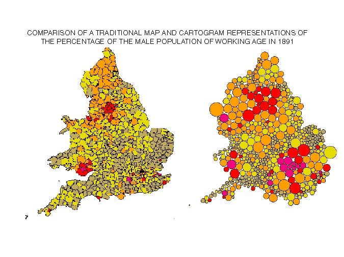
    
## Multivariate data

- curse of dimensionality
    - algoritmy na exploraci jsou tím pomalejší, čím víc je dimenzí
    - víc dimenzí $\to$ řídká data, chybějící hodnoty
    - machine learning: čím víc dimenzí, tím víc (exponenciálně) potřebujeme dat
- cíle
    - najít clustery, pravidelnosti a nepravidelnosti
- line based techniky
    - kreslení linechartů přes sebe a vedle sebe
        - přes sebe - nemůže tam být moc čar
    - předchozí čára slouží jako reference pro následující
- RadViz
    - pro n-dimenzionální dataset máme n referenčních bodů (kotvy), data rozložená tak, že se blíží k tomu, k čemu jsou podobná
        - pro různé pořadí kotev to vypadá různě

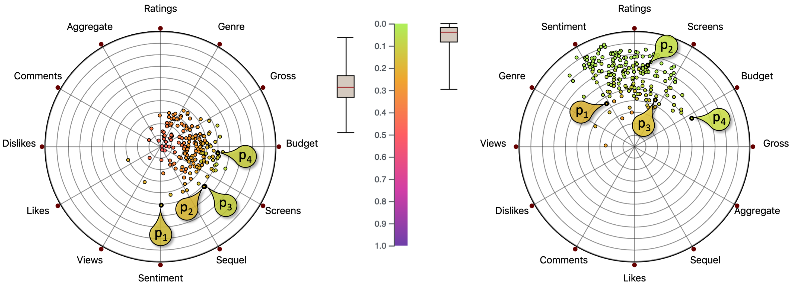

- pro každou vizualizační techniku, která má souřadnicový stystém xy, můžeme mapovat na kruh
    - př. star chart, radial line chart, polar chart, radial bar charts, radial axis

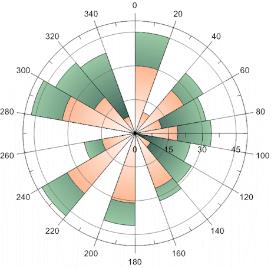

- area - plochu bez reference špatně vnímáme
    - stacked bar chart (na sobě nebo vedle sebe)
    - heatmapy, survey plots - místo barvy velikost vybarveného kusu
    - dimensional stacking - dělení grafu na části podle dimenzí
        - mřížka (X,Y), v mřížce další mřížka (Z,W), v mřížce další mřížka, ...
    - treemap

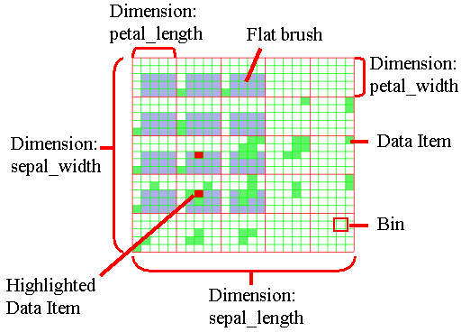

- glyfy a ikony
    - mapujeme vlastnosti dat na vlastnosti glyfů
    - mapování 1:1, jeden atribut na jednu vlastnost, př. barva-teplota
    - mapování 1:N, pro jistotu jeden atribut na více vlastností - př. teplejší oblasti jsou červené a šrafované
    - mapování N:N
    - příklady glyfů - hvězdičky, boxploty, faces, šipky, box-glyph, ...
        - problémy
            - nevnímame jednotlivé vlastnosti rovnoměrně, př. délku snáz než orientaci
            - vzdálené věci se těžko porovnávají
            - pomocí glyfů můžeme zobrazit limitovaný počet dimenzí
        - jak přiřadit vlastnostem glyfu data?
            - korelované atributy vedle sebe
            - aby byly tvary pravidelné
            - seřadit třeba podle času
        - rozdělení v prostoru
            - uniformní
            - kontrolované
                - data driven - př máme v datech souřadnice, PCA, ...
                - structure driven - pokud data třeba obsahují nějakou hierarchii
- dense pixel display
    - mapuje vlastnosti na pixely; obrázky pak skládá do obdélníku, kruhu, ...
- pixel bar chart

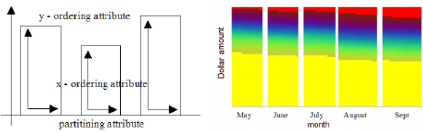

- scatterplots - jak je použít, když máme fakt hodně dimenzí?
    - scatterplot matrix
        - podobné parallel coordinates - když je moc dat, je to nepřehledné - sampling, density, slévání hran
    - výběr dimenzí, které chceme zobrazit
        - ranking techniky
            - hodnotí jednotlivé dimenze nebo jejich dvojice
                - typická hodnotící fce př. počet outlierů, corelace mezi dimenzemi, least square error lineární regrese, entropie, ...
        - výběr pořadí parallel coordinates
        - feature extraction - PCA, MDS
        - problémy: pokud trochu změníme data a uděláme výběr dimenzí znovu, tak může být úplně jiný

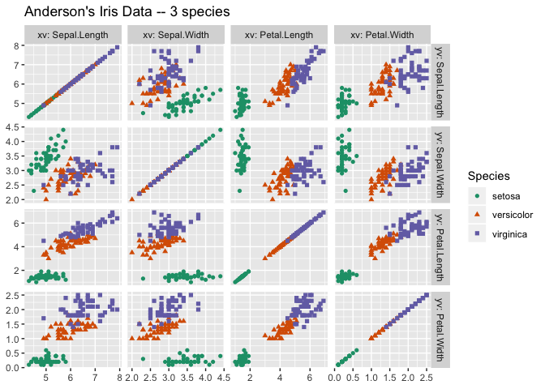

- parallel coordinates

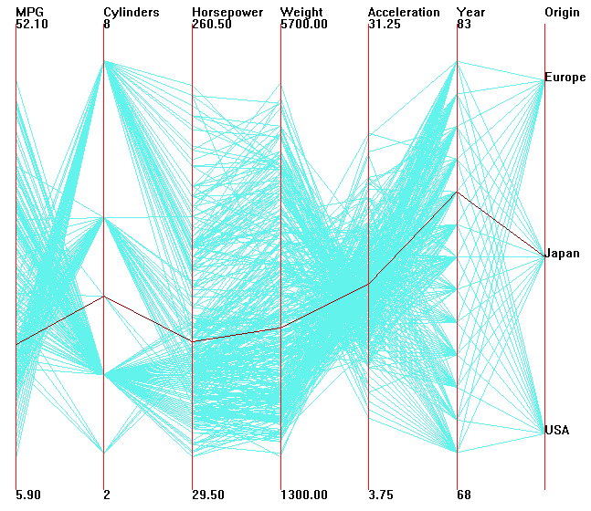

## Stromy, grafy, sítě

- zobrazujeme vztahy mezi objekty
    - mohou být jednoduché, mnohonásobné, orientované, vážené, ...
- stromy
    - zobrazení mohou a nemusí vyplňovat prostor
    - treemaps (soustředí se na listy), radial layout (sunburst display - kořen střed, listy na kraji)

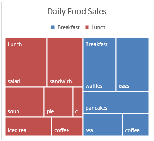

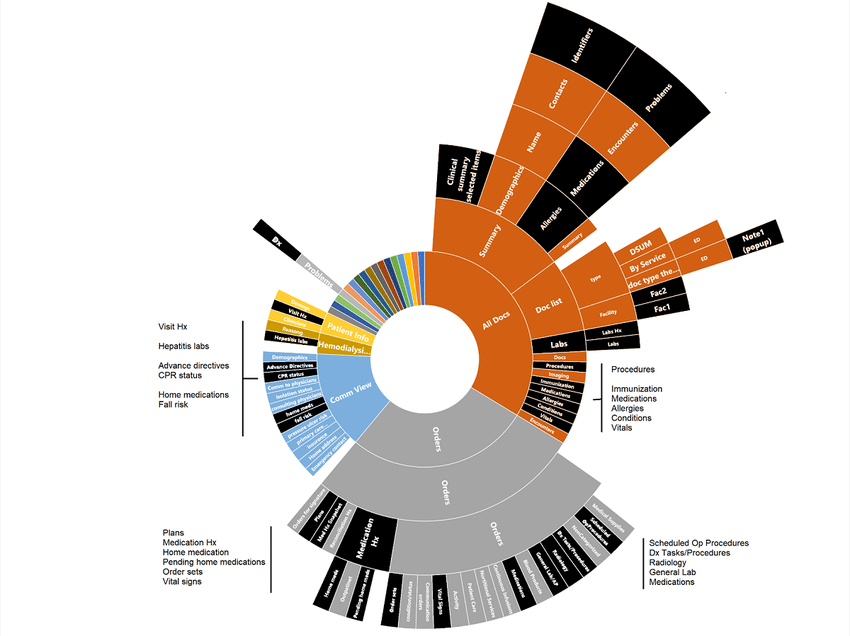

- grafy obecně
    - konvence - rovné hrany, vrcholy v mřížce, ...
    - restrikce - konkrétní vrchol do středu obrazovky, skupina vrcholů u sebe, ...
    - estetika - minimum křížení, krátké hrany, symetrie, ...
- node-link diagram
    - pružinkový algoritmus
    - rovinné grafy - pro zobrazování ideál
        - rozhodujeme, jestli 2-souvislý graf je rovinný - odebereme kružnici, zbytek jako bipartitní, pokud má párování, tak rekurzí
        - kreslení - rovnoběžky spojujeme přímkami, pak z toho graf

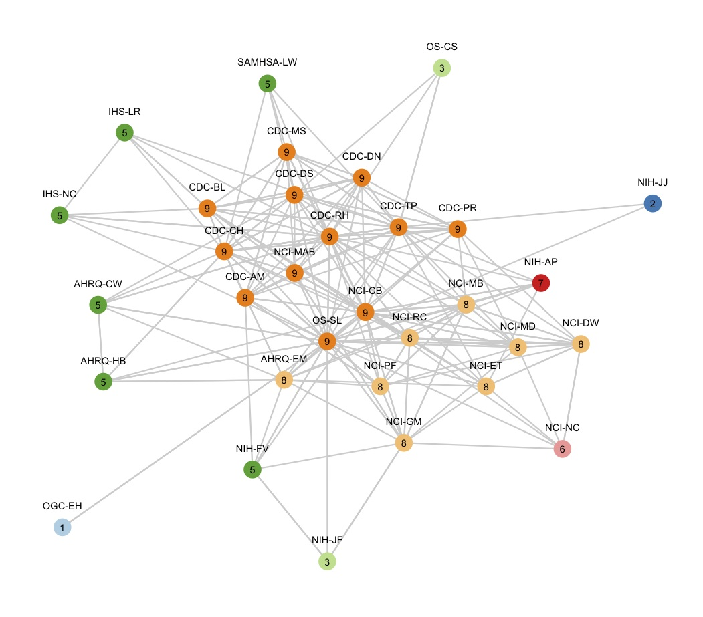

- matice sousednosti - záleží na uspořádání řádků a sloupců
- labeling - je potřeba, pro malý počet labelů se dají jenom barvy, pro hodně vrcholů se dá zobrazovat jen po najetí myší
    - střídání hodně labelů po náhodných podmnožinách po pár vteřinách - blbost
- interakce s grafy
    - otáčení, zoomování, posunování
    - selekce
    - změny struktury grafu - fisheye

## Textové dokumenty

- textu existuje hrozně moc - co s ním chceme dělat?
    - hledat slova a fráze
    - hledat témata
    - hledat vzorce ve strukturovaných textech nebo složkách
    - vztahy mezi odstavce/částmi/dokumenty
- textová reprezentace
    - lexikální - množiny písmen transformujeme na tokeny
        - extrakce nejčastěji pomocí konečných automatů a regulárních výrazů
    - syntax - k tokenům přidáme značky - pozice ve větě, zda je to sloveso, ...
    - sémantika - extrahuje význam a vztahy
- vector space model (VSM)
    - dokumenty jako vektory, každá dimenze vektoru přísluší nějakému termínu (slovu, tokenu) - je li termín v dokumentu, je hodnota tímhle směrem nenulová
    - váhy termínů - term freq. inverse document freq. (tf-idf)
        - počet výskytů termínu v dokumentu tf(w), počet dokumentů, kde se termín vyskytuje df(w), počet dokumentů n
        - $tfidf(w) = tf(w) * \log(N/idf(w))$
    - Zipf's law - distribuce slow v korpusu 
        - frekvence slova v dokumentu je inverzně úměrná jeho ranku ve frekvenční tabulce
- vizualizace dokumentů 
    - tag cloud - velikost slov odpovídá frekvenci
    - word tree - kořen slovo, větve kontexty
    - text arc - tag cloud + hrany k dokumentům na obvodu
    - arc diagram - spojuje stejné subsekvence
    - document fingerprint - pixel prezentuje blok textu, barva př. délku vět
    - slef-organizing map 
    - themescapes - 3D krajina popisující korpus, kopce tam, kde je víc podobných dokumentů
    - document cards - obrázky a klíčová slova
    - můžeme vizualizovat kód - každý řádek obarvíme třeba podle toho, kdy byl naposled upravený, jak často se volá nebo tak
    - vizualizace výsledků hleání - obdélník odpopídá délce textu, barva pixelů odpovídá výskytu hledaných termínů (každý termín v jednom řádku)
    - theme river
    - síť dokumentů, u každého vrcholy s termíny

## Interakce

- navigace = změna pohledu kamery (rotace, posuny přiblížení, ...)
- selekce 
    - granularita selekce - vvybere se po kliknutí jen vrchol, nebo i jeho sousedi?
    - přidá se nová selekce ke staré, nebo se nahradí?
- filtrace - redukujeme množství dat nebo dimenzí ke zobrazení
    - na rozdíl od selekce a par skrytí se obvykle dělá nepřímo
- přeskládání dat - př. PCA, MDS
- překódovací operace - změna typu grafu, barev, markerů, ...
- agregace - linked selection, brushnig (pokud můžeme selekci průběžně měnit)
- abstrakce/konkretizace - distortion operators - třeba lupa
- interakce mohou probíhat na úrovni různých prostorů
    - screen space (pixely) - posun, zoom, lupa, ...
    - data value space - výběr, filtrování
    - komponenty dat
    - komponenty grafického výstupu (prostor atributů)
    - objekty, 3D plochy - opět zoom, otáčení, výběr objektu, perspective walls
    - změny struktury vizalizace - př. skrytí komponent
- animace postupný přecho jednoho pohledu do jiného
    - nejprve určíme krejní body, přímku po které se budeme pohybovat, pak parametrizujeme pohyb
    - chceme se pomalu rozjet, pak jet a pak zabrzdit do nuly, ne trhavé pohyby
        - křivky pozice, rychlosti a zrychlení
            

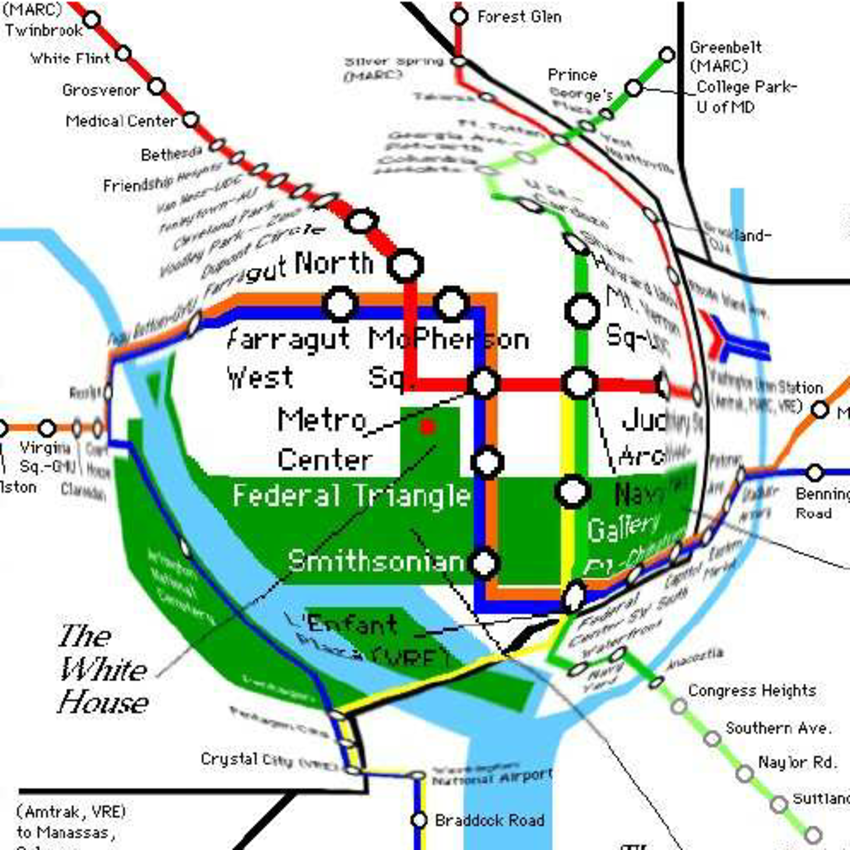

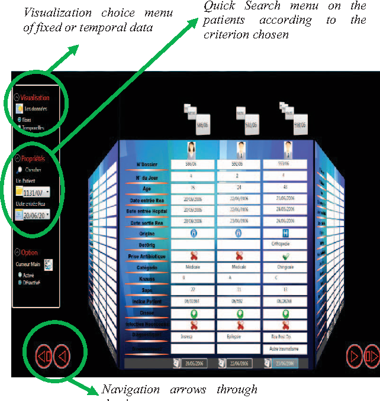